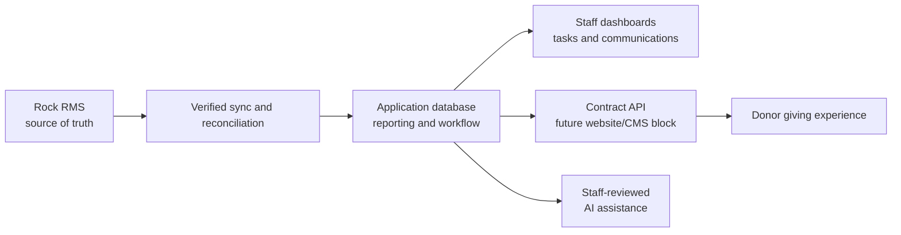

# Church Giving Management

## Problem Frame

The church uses Rock RMS as the source of truth for people, households, giving history, and related ministry data. Rock contains the authoritative records, but extracting, processing, segmenting, emailing, and operationalizing giving information is complex enough that staff need a purpose-built system around it.

The desired product is a giving management platform that syncs from Rock, supports dashboards and operational workflows, and eventually exposes APIs that can power a donor-facing giving experience in the church website or CMS.

## Requirements

**Source of Truth and Sync**
- R1. Rock RMS remains the authoritative source for people, households, gifts, giving status, and any field that Rock already owns.
- R2. The system must sync Rock data into its own database for reporting, workflow, and API use without silently overwriting Rock-owned data.
- R3. Sync behavior must be observable by staff and agents, including last successful sync, failures, skipped records, and reconciliation concerns.
- R4. The system must preserve enough source metadata to trace derived records back to the Rock records they came from.

**Giving Intelligence and Operations**
- R5. Staff must be able to view giving dashboards for trends, segments, donor lifecycle movement, and operational exceptions.
- R6. Staff must be able to define and track tasks related to giving follow-up, stewardship, data cleanup, and ministry operations.
- R7. Staff must be able to prepare targeted communication workflows, including segmentation and email handoff, while respecting permission and privacy boundaries.
- R8. The system should support explainable derived metrics so staff can understand why a person, household, or gift appears in a segment or dashboard.

**Donor-Facing Giving Experience**
- R9. The platform should eventually expose an API suitable for a website or CMS block where donors can start giving, log in, and manage giving-related setup.
- R10. Donor-facing views must show real giving setup/status from the authoritative integration path, not stale or invented local state.
- R11. Any donor-facing account, payment, or recurring gift management must respect the boundaries of Rock RMS and the payment processor after their APIs are verified.

**Security, Privacy, and Compliance**
- R12. The system must treat donor identity, giving history, payment setup, and communication preferences as sensitive data.
- R13. Authentication must use Auth0, while authorization must distinguish staff/admin workflows from donor-facing workflows.
- R14. Logs, agent tools, analytics, and AI features must avoid exposing unnecessary donor PII or financial details.
- R15. Any AI-assisted workflows must produce reviewable recommendations and explanations, not autonomous donor communications or financial decisions.
- R16. The system must manage its own application users, roles, and permissions independently instead of syncing Rock users into local app users. Auth0-authenticated users without a local active app user must see a limited access screen with an invitation/access request action and no staff data.

**Agent Productivity**
- R17. The repo must maintain clear agent instructions for Codex, Claude, and future coding agents.
- R18. Durable product decisions, plans, implementation notes, and unresolved questions should live in `docs/` so agents can resume work without reconstructing context from chat.
- R19. Agent-facing instructions must prioritize safe handling of donor data, Rock as source of truth, testable changes, and explicit documentation of assumptions.

## Success Criteria

- Staff can answer core giving questions without exporting spreadsheets from Rock for every analysis.
- Staff can see whether synced data is fresh, complete, and trustworthy.
- Follow-up tasks and communication prep become trackable workflows instead of ad hoc manual processes.
- The architecture can support both internal dashboards and future donor-facing giving surfaces without coupling every consumer to Rock directly.
- Future agents can enter the repo, understand the product boundaries, and make progress without unsafe assumptions about donor data, payments, or Rock ownership.

## Scope Boundaries

- The first planning pass should not replace Rock RMS.
- The first planning pass should not migrate historical ownership away from Rock.
- The first planning pass should not implement donor-facing payments until Rock and payment processor capabilities are verified.
- AI features should assist staff with analysis, summarization, prioritization, and drafting; they should not send communications or make stewardship decisions without human review.
- This brainstorm does not choose a final deployment provider, payment processor integration strategy, or exact Rock sync mechanism.

## Key Decisions

- Rock remains source of truth: The platform is an operational and intelligence layer, not a replacement church management system.
- Favor an independent application database: Reporting, dashboards, segmentation, task management, and agent tools need query patterns that should not depend on live Rock queries.
- Prefer a contract-first public API direction: Because donor-facing website/CMS blocks and possible multi-repo consumers are likely, GraphQL is a better default external API shape than tRPC. tRPC may still be useful for purely internal, single-repo Next.js surfaces if planning finds a clear benefit.
- Put the GraphQL API in the Next.js `app/api` route tree: The preferred default is a normal App Router route handler such as `app/api/graphql/route.ts`, not a separate API service.
- Use Auth0 for authentication: The app should integrate with Auth0 directly and maintain its own local app user/role records instead of syncing Rock users.
- Require local authorization after Auth0 login: A user who can authenticate through Auth0 is not automatically allowed into staff workflows. They need an active local app profile and role.
- Provide an access request path: Auth0-authenticated users without local access should be able to request an invite/access, creating an admin-visible notification or request record.
- Use local roles first: Initial roles should be app-local. The first role set is Admin, Finance, and Pastoral Care.
- Admin role: Admin users have full access across finance, people, donations, tasks, communications, settings, and administration.
- Finance role: Finance users can see giving amounts and the limited person/household details needed to identify donors, reconcile records, and understand giving context.
- Pastoral Care role: Pastoral Care users can see donor and household context needed for care and follow-up, communications, tasks, and reports, but actual giving amounts and individual-level giving aggregates must be hidden from this role.
- Defer user-management UI: First implementation may manage users and roles through Postgres or seed/admin tooling instead of a dedicated UI.
- Link local users to Rock people opportunistically: The app may attempt an email-based Rock person link for profile/avatar context, but this link is optional and must not be required for authorization.
- Treat Yoga, Pothos, Prisma, and Next.js as the preferred starting stack: This matches the user's prior successful experience while keeping the final plan responsible for validating current library fit.
- AI should be staff-assistive first: The most valuable initial AI work is likely donor/giving summarization, anomaly explanation, segment rationale, task suggestions, and draft communication assistance with human approval.

## Conceptual Data Flow

This diagram is conceptual only. Planning must still verify the actual Rock integration path, payment processor capabilities, auth model, and API boundaries before implementation.

## Suggested Product Phases

**Phase 1: Foundation**
- Establish the Next.js application shell, database, Prisma models, auth boundaries, and agent-friendly repo conventions.
- Build a verified Rock sync spike before committing to the full sync design.
- Create initial staff-only dashboards for sync health and basic giving metrics.

**Phase 2: Staff Operations**
- Add donor/household giving profiles, segmentation, task management, and communication preparation workflows.
- Add explainable metrics and staff-reviewed AI assistance.

**Phase 3: Donor-Facing API**
- Expose a stable API for website/CMS giving blocks.
- Add donor authentication and giving setup/status management after integration boundaries are confirmed.

## AI Opportunity Areas

- Summarize donor or household giving history for staff review.
- Explain why a donor appears in a segment or exception list.
- Suggest follow-up tasks based on giving lifecycle changes, missed recurring patterns, or data cleanup needs.
- Draft stewardship emails or call notes for staff approval.
- Detect anomalies, duplicate-looking records, sync inconsistencies, and metric outliers.
- Provide an internal agent tool interface for safe queries like "show households whose giving changed materially this quarter" with permission checks and audit logging.

## Dependencies / Assumptions

- Rock RMS has an integration path that can provide people, households, giving records, and relevant giving setup data. This must be verified during planning against the church's Rock version and configuration.
- Auth0 is available as the authentication platform and is already used by users on Rock.
- Staff and future donor-facing access use the same Auth0 application unless a later security review finds a concrete reason to split clients.
- The payment processor and Rock giving configuration determine what donor-facing management can safely support.
- Email sending may be handled by Rock, an external email system, or this platform; the right boundary remains undecided.

## Outstanding Questions

### Resolve Before Planning

- None.

### Deferred to Planning

- [Affects R2][Needs research] Which Rock APIs, exports, webhooks, or database access patterns are available and appropriate for this church's Rock RMS instance?
- [Affects R9-R11][Needs research] Which payment processor and recurring gift management APIs are actually in use, and what operations should remain outside this system?
- [Affects R13-R16][Technical] Which administrator notification channel should access requests use first: app notification record only, email, Slack, or another workflow?
- [Affects R5-R8][Product] Which giving metrics are most important for the first dashboard: total giving, recurring giving health, donor lifecycle, campaign/fund performance, pledges, exceptions, or household-level trends?
- [Affects R7][Product] Should email workflows initially hand off to Rock/external email tools, or should this system send emails directly after approval?
- [Affects R17-R19][Technical] Should this begin as one Next.js repo with a strong internal API boundary, or a multi-repo setup from day one?

## Next Steps

-> `/ce:plan` for structured implementation planning.
