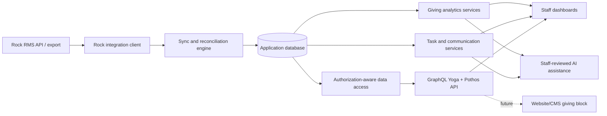

# feat: Establish Giving Management Foundation

## Overview

Build the first durable foundation for a church giving management platform around Rock RMS. This plan creates a Next.js/TypeScript/Prisma application, integrates Auth0 authentication with app-local user management, verifies Rock integration boundaries before committing to sync behavior, establishes a contract-first GraphQL API under the Next.js `app/api` route tree, adds staff-facing sync and giving dashboards, and sets guardrails for future donor-facing and AI-assisted work.

This is the first implementation plan for a greenfield repo. It intentionally focuses on the foundation and staff-only MVP surfaces. Donor-facing payment management remains out of scope until Rock and payment processor capabilities are verified.

## Problem Frame

Rock RMS is the source of truth for people, households, gifts, and Rock-owned giving data, but staff need a more usable operational layer for reporting, segmentation, follow-up, communication prep, and eventually donor-facing giving APIs (see origin: `docs/brainstorms/2026-04-17-church-giving-management-requirements.md`).

The planning challenge is to create enough application structure that future agents can move quickly while avoiding unsafe assumptions about donor data, payments, Rock ownership, auth, and AI access.

## Requirements Trace

- R1. Preserve Rock RMS as the authoritative source for people, households, gifts, giving status, and Rock-owned fields.
- R2. Sync Rock data into an application database for reporting, workflow, and API use without silently overwriting Rock-owned data.
- R3. Make sync behavior observable, including last successful sync, failures, skipped records, and reconciliation concerns.
- R4. Preserve source metadata that traces derived records back to Rock.
- R5. Provide staff dashboards for giving trends, segments, donor lifecycle movement, and operational exceptions.
- R6. Support staff-defined tasks for giving follow-up, stewardship, data cleanup, and ministry operations.
- R7. Support targeted communication preparation and email handoff without bypassing permission and privacy boundaries.
- R8. Make derived metrics explainable to staff.
- R9. Establish an API shape suitable for a future website/CMS giving block.
- R10. Ensure future donor-facing views show real authoritative setup/status rather than invented local state.
- R11. Defer donor account, payment, and recurring gift management until Rock/payment boundaries are verified.
- R12. Treat donor identity, giving history, payment setup, and communication preferences as sensitive data.
- R13. Use Auth0 for authentication and separate staff/admin authorization from future donor-facing authorization.
- R14. Prevent logs, agent tools, analytics, and AI features from exposing unnecessary donor PII or financial details.
- R15. Keep AI-assisted workflows reviewable by staff.
- R16. Manage application users, roles, and permissions locally rather than syncing Rock users into local app users. Auth0 users without local access see a limited access request flow, not staff data.
- R17. Maintain clear agent instructions for Codex, Claude, and future coding agents.
- R18. Keep durable decisions, plans, implementation notes, and unresolved questions in `docs/`.
- R19. Prioritize safe donor data handling, Rock source-of-truth boundaries, testable changes, and explicit assumptions.

## Scope Boundaries

- Do not replace Rock RMS.
- Do not migrate source ownership away from Rock.
- Do not implement donor-facing payment setup or recurring gift mutation flows in this plan.
- Do not send donor communications autonomously.
- Do not rely on live Rock queries for dashboards as the normal runtime path.
- Do not choose a deployment provider unless implementation discovers a hard constraint.

### Deferred to Separate Tasks

- Donor-facing giving block: separate plan after Rock/payment/auth research confirms allowed capabilities.
- Payment processor integration: separate plan after the actual processor and recurring gift API boundaries are known.
- Email sending automation: separate plan after staff chooses whether email is sent by Rock, an external email tool, or this app.
- Advanced AI agent tools: separate plan after staff-only auth, audit logs, and redaction policies exist.
- Dedicated user-management UI: separate plan after the first staff-only access model is proven. Initial user and role management may happen through Postgres or seed/admin tooling.

## Context & Research

### Relevant Code and Patterns

- The repo currently has no application scaffold, manifests, tests, or source code.
- `AGENTS.md` is the primary repo instruction source. It requires Rock source-of-truth boundaries, sensitive donor data handling, testable changes, and explicit assumptions.
- `.devcontainer/` exists and should be preserved unless later work intentionally changes local development infrastructure.

### Institutional Learnings

- No `docs/solutions/` directory exists yet, so there are no prior institutional learnings to apply.

### External References

- Next.js route handlers are defined inside the App Router `app` directory and support HTTP methods such as `GET`, `POST`, and `OPTIONS`; route handlers are not cached by default. Source: <https://nextjs.org/docs/app/getting-started/route-handlers>
- Prisma's current Next.js guide uses Node.js 20.19+ and covers App Router, Prisma Client setup, migrations, and production generation concerns. Source: <https://docs.prisma.io/docs/v6/guides/nextjs>
- Prisma documents expand-and-contract migrations for production schema changes where data consistency and downtime matter. Source: <https://www.prisma.io/docs/guides/database/data-migration>
- GraphQL Yoga documents Next.js App Router integration through `app/api/graphql/route.ts` and exports handlers for `GET`, `POST`, and `OPTIONS`. Source: <https://the-guild.dev/graphql/yoga-server/docs/integrations/integration-with-nextjs>
- Pothos's Prisma plugin provides type-safe Prisma-backed GraphQL types and query optimization that helps avoid relation N+1 queries. Source: <https://pothos-graphql.dev/docs/plugins/prisma>
- Rock Community documents API v1 and API v2 resources, with v1 described as legacy and v2 as the newer API line. Source: <https://community.rockrms.com/api-docs/>
- Rock REST API docs indicate REST controllers are discoverable in Rock under `Home > Security > REST Controllers`; older OData support is documented as deprecated and unavailable in API v2. Source: <https://community.rockrms.com/developer/303---blast-off/the-rock-rest-api>
- OWASP API Security Top 10 2023 highlights authorization risks, sensitive business flows, SSRF, misconfiguration, improper inventory, and unsafe API consumption as relevant API design concerns. Source: <https://owasp.org/API-Security/editions/2023/en/0x00-header/>
- OWASP's GenAI security project identifies LLM application risks such as prompt injection and insecure output handling, which should shape AI guardrails. Source: <https://owasp.org/www-project-top-10-for-large-language-model-applications/>

## Key Technical Decisions

- Build a single Next.js app first: A single repo with explicit module boundaries is lower carrying cost than a multi-repo split while still supporting a contract API for future consumers.
- Use GraphQL as the primary external API contract in `app/api`: Future website/CMS consumers should not depend on tRPC or direct internal module calls. The default API location is `app/api/graphql/route.ts` unless implementation finds a concrete reason to split it.
- Use Auth0 for authentication: Auth0 is the chosen identity platform. The app should maintain its own app user, role, and permission records instead of syncing Rock users into local users.
- Require active local access after Auth0 login: Auth0 proves identity, but an active local app user and local role are required for staff data access.
- Provide a limited access-request screen: Auth0-authenticated users without local access should see a message that they need administrator approval and a button to request an invite/access.
- Keep roles app-local first: Initial roles should be Admin, Finance, and Pastoral Care.
- Admin visibility: Admin has full access across finance, people, donations, tasks, communications, settings, and administration.
- Finance visibility: Finance can see giving amounts and limited person/household details needed to identify donors, reconcile records, and understand giving context.
- Pastoral Care visibility: Pastoral Care can see communications, tasks, reports, donor/household care context, trends, and follow-up cues, but cannot see actual giving amounts or individual-level giving aggregates.
- Use the same Auth0 application initially: Staff and future donor-facing access should share the existing Auth0 application unless a later security review identifies a concrete need to separate clients.
- Make Rock person linking optional: A local app user may link to a Rock person by email for profile context such as avatar, but authorization must not depend on that link.
- Keep business logic outside route handlers and UI components: Rock sync, giving analytics, task workflows, communication prep, auth checks, and AI assistance should live in domain modules that GraphQL resolvers and UI routes call.
- Store synced Rock data with source metadata: Every synced entity should carry Rock IDs, source timestamps when available, sync run references, and local derivation metadata.
- Treat sync as reconciliation, not blind import: Sync should record skipped records, conflicts, deletes/inactive statuses, and downstream metric rebuild status.
- Make staff-only authorization the first auth target: Donor-facing access is future work, but the app must avoid designs that assume every Auth0-authenticated user can access staff data.
- Use generated and validated types where possible: Prisma, Pothos, and runtime validation at integration boundaries should reduce stringly-typed sync code.
- Introduce AI only behind staff review and redaction: Initial AI features should use curated summaries and scoped context, not unrestricted database access.

## Open Questions

### Resolved During Planning

- One repo or multi-repo first: Start with one Next.js repo and a clear GraphQL boundary. This keeps setup simple while leaving room for future consumers.
- GraphQL or tRPC as the main API: Use GraphQL for the external contract. Consider tRPC only for internal-only developer experience if it does not fragment the API surface.
- API placement: Put GraphQL in the Next.js `app/api` route tree, starting with `app/api/graphql/route.ts`.
- Auth provider and user sync: Use Auth0 for authentication. Do not sync Rock users into local app users; manage app users, roles, and permissions independently.
- Auth0 login without local app access: Show a limited access screen with administrator-contact language and a request invite/access button.
- Role source: Keep roles local to the app for now rather than trusting Auth0 roles/groups for authorization.
- Auth0 application split: Use the same Auth0 application for now.
- Rock person linking: Link local users to Rock people by email when possible for profile context; do not require the link for authorization.
- User management UI: Defer dedicated user-management UI. Initial local users and roles may be managed through Postgres or seed/admin tooling.
- Should donor-facing payments be in the MVP: No. Payment and recurring gift mutation flows wait for verified Rock/payment processor capabilities.
- Should the first email workflow send messages: No. The first workflow should prepare segments and draft/handoff artifacts; sending is deferred.

### Deferred to Implementation

- Exact Rock API version and endpoints: Must be verified against the church's Rock instance and documented in `docs/research/rock-integration.md`.
- Exact payment processor and supported recurring gift operations: Must be verified before any donor-facing payment feature.
- Access-request review surface: First pass only persists access request database records. A later user-management UI should decide where administrators review and approve them.
- First dashboard metric set: Begin with sync health, total giving trend, recurring giving health, donor lifecycle movement, and operational exceptions unless staff chooses a narrower starting set during implementation.
- Deployment provider: Leave open until app scaffold, database, background job needs, and church infrastructure preferences are clearer.

## Output Structure

The expected shape is directional. The implementing agent may adjust names and directories when implementation reveals a better fit, but should preserve the boundaries.

```text
app/
  api/graphql/route.ts
  access-request/
  dashboard/
  sync/
  tasks/
components/
  dashboard/
  sync/
  tasks/
docs/
  architecture/
  brainstorms/
  plans/
  research/
lib/
  ai/
  auth/
  communications/
  giving/
  graphql/
  rock/
  sync/
  tasks/
prisma/
  migrations/
  schema.prisma
  seed.ts
tests/
  integration/
  unit/
```

## High-Level Technical Design

> _This illustrates the intended approach and is directional guidance for review, not implementation specification. The implementing agent should treat it as context, not code to reproduce._



## Implementation Units

- [x] **Unit 1: Scaffold the Application and Tooling**

**Goal:** Create the Next.js/TypeScript/Prisma application foundation with test tooling and repo commands.

**Requirements:** R17, R18, R19

**Dependencies:** None

**Files:**

- Create: `package.json`
- Create: `tsconfig.json`
- Create: `next.config.ts`
- Create: `eslint.config.mjs`
- Create: `vitest.config.ts`
- Defer: `playwright.config.ts` until browser coverage is introduced.
- Create: `app/layout.tsx`
- Create: `app/page.tsx`
- Create: `components/`
- Create: `lib/`
- Create: `tests/unit/`
- Defer: `tests/integration/` until database-backed integration tests are introduced.
- Modify: `AGENTS.md`
- Test: `tests/unit/app-smoke.test.ts`

**Approach:**

- Scaffold a modern Next.js App Router app at the repo root.
- Use TypeScript, ESLint, Vitest for unit/domain tests, and Playwright for future browser coverage.
- Prefer pnpm unless implementation discovers a repo or environment reason to choose another package manager.
- Add command documentation to `AGENTS.md` after real commands exist.
- Keep the initial UI minimal and staff-oriented; avoid landing-page marketing work.

**Patterns to follow:**

- Existing repo convention: durable guidance belongs in `AGENTS.md` and `docs/`.
- Next.js App Router route and UI conventions from official docs.

**Test scenarios:**

- Happy path: rendering the root app smoke test should confirm the application shell loads without throwing.
- Integration: test configuration should discover unit tests under `tests/unit/` and leave room for integration tests under `tests/integration/`.
- Error path: typecheck/lint setup should fail on obvious TypeScript or lint violations once implementation adds commands.

**Verification:**

- The repo has a runnable app scaffold, documented local commands, and a passing smoke test.

- [x] **Unit 2: Document Rock Integration Research**

**Goal:** Verify available Rock integration paths before writing irreversible sync assumptions into code.

**Requirements:** R1, R2, R3, R4, R10, R11, R17, R18, R19

**Dependencies:** Unit 1

**Files:**

- Create: `docs/research/rock-integration.md`
- Create: `docs/research/payment-and-giving-boundaries.md`
- Create: `lib/rock/types.ts`
- Create: `lib/rock/fixtures/`
- Test: `tests/unit/rock-fixtures.test.ts`

**Approach:**

- Document the church's Rock version, API v1/v2 availability, authentication mechanism, relevant REST controllers, rate limits if known, and whether exports, webhooks, jobs, or direct database access are allowed.
- Capture sample sanitized payloads as fixtures, not real donor data.
- Explicitly record whether OData is unavailable or inappropriate for the selected API path.
- Document payment processor, recurring gift ownership, and what donor-facing operations are forbidden until later work.

**Execution note:** Treat this as research-first. Do not implement sync behavior until the research file identifies at least one viable read path for people, households, gifts, and giving setup/status.

**Patterns to follow:**

- `docs/brainstorms/2026-04-17-church-giving-management-requirements.md` for source-of-truth and deferred-question framing.

**Test scenarios:**

- Happy path: sanitized fixture payloads validate against local Rock fixture schemas.
- Edge case: fixture validation accepts missing optional fields that Rock may omit but rejects missing required source identifiers.
- Error path: fixture validation rejects payloads containing obviously unsafe sample secrets, access tokens, or full payment instrument values.

**Verification:**

- Future agents can read `docs/research/rock-integration.md` and know which Rock path to implement, which fields are verified, and which assumptions remain open.

**Progress note 2026-04-17:**

- Created `docs/research/rock-integration.md` and `docs/research/payment-and-giving-boundaries.md`.
- Added the first sanitized fixture contract in `lib/rock/types.ts`.
- Added fake sample data in `lib/rock/fixtures/sanitized-rock-sample.json`.
- Added `tests/unit/rock-fixtures.test.ts` for valid fixtures, broken references, missing reconciliation timestamps, obvious secrets, and full payment instrument values.
- Added `pnpm rock:discover` for read-only Rock endpoint status and JSON-shape discovery without raw response values.
- Confirmed Rock 17 church-hosted on Azure, API v2 docs availability, and API v1 REST readability for people, groups, group members, campuses, financial accounts, financial transactions, financial transaction details, and financial scheduled transactions.
- Confirmed stakeholder-owned person, household/family, campus, group membership, transaction, and scheduled-transaction relationship paths without committing raw values.
- Confirmed group type taxonomy access and identified `Connect Group` (`GroupTypeId = 25`) as the member-facing small-group boundary. `Small Group Section` appears to be hierarchy/organization context.
- Confirmed one-off transaction/detail shape from the stakeholder-owned record and scheduled transaction/detail shape from value-free global samples.
- Confirmed Rock's `GroupMemberStatus` enum mapping: `0 = Inactive`, `1 = Active`, `2 = Pending`.
- Expanded sanitized fixture types to include campuses, groups, and group members.
- Unit 2 research is complete enough to support Unit 3 data modeling. Keep the no-write Rock boundary and high-risk REST key handling in force during implementation.

- [x] **Unit 3: Establish the Data Model and Migration Baseline**

**Goal:** Create the initial Prisma schema for synced source records, sync runs, giving facts, staff tasks, communication prep, and audit-friendly metadata.

**Requirements:** R1, R2, R3, R4, R5, R6, R7, R8, R12, R14

**Dependencies:** Unit 2

**Files:**

- Create: `prisma/schema.prisma`
- Create: `prisma/seed.ts`
- Create: `lib/db/prisma.ts`
- Create: `lib/giving/models.ts`
- Create: `lib/sync/models.ts`
- Create: `lib/tasks/models.ts`
- Create: `docs/architecture/data-model.md`
- Test: `tests/unit/data-model.test.ts`
- Test: `tests/integration/prisma-migrations.test.ts`

**Approach:**

- Model local records around source traceability: Rock IDs, sync run IDs, source timestamps, data freshness, derivation state, and local workflow state.
- Separate Rock-owned fields from locally owned fields so updates cannot accidentally write back to Rock-owned concepts.
- Include sync run, sync issue, and reconciliation tables before building dashboard features.
- Use Prisma migrations rather than schema push for persistent schema changes.
- Document field ownership and sensitive fields in `docs/architecture/data-model.md`.

**Execution note:** Implement domain model behavior test-first where ownership, traceability, or sensitivity rules are encoded.

**Patterns to follow:**

- Prisma production migration guidance, including expand-and-contract thinking for future schema changes.

**Test scenarios:**

- Happy path: a synced gift/person/household fixture can be persisted with Rock source metadata and associated with a sync run.
- Happy path: a staff task can attach to a synced person or household without becoming the source of truth for Rock data.
- Edge case: duplicate Rock source IDs should update or reconcile deterministically rather than creating ambiguous local records.
- Edge case: missing source metadata should be rejected for records that represent Rock-owned data.
- Error path: attempts to persist sensitive payment instrument details beyond approved metadata should fail validation.
- Integration: migrations apply cleanly against a test database and Prisma Client can query the baseline models.

**Verification:**

- The database schema supports traceable synced data, staff workflow state, and sync observability without claiming ownership of Rock-owned fields.

**Progress note 2026-04-17:**

- Added the synced Rock data model to `prisma/schema.prisma`.
- Added migration baseline `prisma/migrations/20260417000000_initial_baseline/migration.sql`.
- Added `SyncRun` and `SyncIssue` for sync observability and reconciliation.
- Added Rock-owned synced tables for campuses, people, households, household members, groups, group members, financial accounts, transactions, transaction details, scheduled transactions, and scheduled transaction details.
- Added Rock reference tables for group types, group roles, defined values, and person aliases so Rock reference IDs are backed by synced local rows.
- Clarified that local households are Rock Family groups (`GroupTypeId = 10`) and preserve `People.GivingGroupId`, `People.GivingId`, and giving leader metadata for giving rollups.
- Added `GivingFact` for one-off, scheduled recurring, inferred recurring, and pledge-backed reporting rows.
- Added `StaffTask` and `CommunicationPrep` as local workflow records that can attach to synced people or households without claiming Rock ownership.
- Added `docs/architecture/data-model.md`.
- Added guardrail helpers in `lib/sync/models.ts`, `lib/giving/models.ts`, and `lib/tasks/models.ts`.
- Added `tests/unit/data-model.test.ts` and `tests/integration/prisma-migrations.test.ts`.
- Squashed early local migrations into a single baseline because the application is not deployed yet.
- Reset the local database from that baseline and regenerated Prisma Client with `pnpm prisma generate`.
- Re-verified the expanded full sync against the live Rock instance: 180,509 source records read, 245,395 local writes, 1 skipped warning, and zero missing references across the new group type, group role, defined value, and person alias links.

- [ ] **Unit 4: Build the Rock Sync and Reconciliation Foundation**

**Goal:** Implement a first read-only sync path from sanitized Rock fixtures and then from the verified Rock integration path, recording sync health and reconciliation issues.

**Requirements:** R1, R2, R3, R4, R10, R12, R14

**Dependencies:** Units 2 and 3

**Files:**

- Create: `lib/rock/client.ts`
- Create: `lib/rock/client.test.ts`
- Create: `lib/sync/run-sync.ts`
- Create: `lib/sync/reconcile.ts`
- Create: `lib/sync/redaction.ts`
- Create: `app/sync/page.tsx`
- Create: `components/sync/sync-status.tsx`
- Test: `tests/unit/sync-reconciliation.test.ts`
- Test: `tests/integration/rock-sync.test.ts`

**Approach:**

- Start with fixture-backed sync so transformation logic is testable without live Rock access.
- Add the live Rock client behind configuration after research identifies the API path.
- Record sync run status, counts, failures, skipped records, changed records, and reconciliation issues.
- Redact logs and errors before they reach application logs or UI.
- Keep sync read-only with respect to Rock in this phase.

**Execution note:** Add fixture-backed characterization tests before wiring live Rock calls.

**Patterns to follow:**

- Rock docs for REST controller discovery and authentication.
- `AGENTS.md` guidance on no invented Rock behavior and no unsafe logging.

**Test scenarios:**

- Happy path: a fixture sync creates a successful sync run with expected counts and source metadata.
- Happy path: unchanged fixture data produces an idempotent sync result rather than duplicate records.
- Edge case: a record removed or marked inactive upstream is represented as a reconciliation state rather than deleted silently.
- Edge case: partial upstream data creates a skipped record or sync issue with a staff-readable reason.
- Error path: Rock authentication failure records a failed sync run without leaking tokens.
- Error path: malformed Rock response is captured as a sync issue and does not partially commit unrelated records.
- Integration: a full fixture sync persists records, issues, and sync run state in the test database.

**Verification:**

- Staff and agents can inspect sync freshness, failures, and reconciliation issues without accessing live Rock directly.

**Progress note 2026-04-17:**

- Added read-only Rock client in `lib/rock/client.ts`.
- Added `pnpm rock:sync` for full live sync into the local database using the verified API v1 read surface.
- Kept `pnpm rock:sync-person <rock-person-id>` as a narrow debug probe for stakeholder-approved records only.
- Added pg-boss dependency and scripts for queued/scheduled full sync: `sync:enqueue`, `sync:schedule`, and `sync:worker`.
- Added sync persistence in `lib/sync/run-sync.ts`.
- Added reconciliation issue types in `lib/sync/reconcile.ts`.
- Added redaction helpers in `lib/sync/redaction.ts`.
- Added `tests/unit/rock-client.test.ts`.
- Added `tests/unit/sync-reconciliation.test.ts`.
- Added `tests/integration/rock-sync.test.ts`.
- Verified sanitized fixture sync persists local records and derived giving facts.
- Ran live full sync using only API v1 `GET` requests. Result: succeeded with 164,986 source records read, 229,872 local writes, 1 skipped record, and 1 issue.
- Verified the pg-boss full-sync path locally by enqueuing `rock-full-sync`, processing it once with `pnpm sync:worker -- --once`, and scheduling hourly full sync with `pnpm sync:schedule "0 * * * *"`. The worker result also succeeded with 164,986 source records read, 229,872 local writes, 1 skipped record, and 1 issue.
- Confirmed the local pg-boss schedule table contains `rock-full-sync` only for the recurring sync.
- Changed Rock mirror tables to use `rockId` as their primary key while local app-owned/derived tables keep local generated IDs.
- Chunked full-sync persistence by stage and added safe progress output for direct sync and pg-boss worker runs.
- Reset the local database after squashing migrations, dropped stale pg-boss schema state, regenerated Prisma Client, and reran `SYNC_CHUNK_SIZE=1000 pnpm rock:sync` successfully. Clean-database result: 164,986 source records read, 229,872 local writes, 1 skipped record, and 1 issue.
- Family people are fetched from family `GroupMembers` so the local family/household includes the grouped people, not only the target person.
- Moved fixture-backed database tests behind `TEST_DATABASE_URL` so demo records cannot pollute the local development database used for live Rock sync.
- Remaining Unit 4 work: add richer reconciliation for inactive/removed records, run the pg-boss worker under the intended deployment process, and finish staff-visible sync status UI.

- [ ] **Unit 5: Establish the GraphQL API Boundary**

**Goal:** Add a GraphQL Yoga + Pothos API that exposes staff-safe queries for sync status, giving summaries, tasks, and communication prep.

**Requirements:** R5, R6, R7, R8, R9, R12, R13, R14, R16

**Dependencies:** Units 3 and 4

**Files:**

- Create: `app/api/graphql/route.ts`
- Create: `lib/graphql/builder.ts`
- Create: `lib/graphql/context.ts`
- Create: `lib/graphql/schema.ts`
- Create: `lib/graphql/types/`
- Create: `lib/auth/session.ts`
- Create: `lib/auth/permissions.ts`
- Create: `lib/auth/users.ts`
- Create: `lib/auth/access-requests.ts`
- Create: `lib/auth/rock-person-link.ts`
- Create: `app/api/auth/[auth0]/route.ts`
- Create: `app/access-request/page.tsx`
- Create: `components/auth/access-request.tsx`
- Create: `docs/architecture/api-boundary.md`
- Create: `docs/architecture/auth0-user-management.md`
- Test: `tests/unit/graphql-auth.test.ts`
- Test: `tests/unit/auth0-user-management.test.ts`
- Test: `tests/unit/access-request.test.ts`
- Test: `tests/integration/graphql-api.test.ts`

**Approach:**

- Use Yoga through a Next.js App Router route handler at `app/api/graphql/route.ts`.
- Use Pothos with Prisma integration for type-safe schema construction and efficient relation loading.
- Integrate Auth0 through Next.js route handlers and treat Auth0 identity as the login source, not as the application's authorization database.
- Create local app user records keyed to Auth0 subject identifiers and manage app-specific roles/permissions locally.
- Do not import or sync Rock users into local app user management.
- When an Auth0-authenticated user has no active local app user or role, route them to a limited access screen that says they need to contact an administrator for further access and offers a request invite/access button.
- Persist access requests with Auth0 subject, email, display name if available, request status, and timestamps. Do not add admin notification UI, email, Slack, or other outbound notifications in the first pass.
- Define the first local role set and permission matrix in `docs/architecture/auth0-user-management.md`: Admin, Finance, and Pastoral Care.
- Ensure the permission matrix grants Admin full access, allows Finance to see giving amounts with limited person/household details, and hides actual giving amounts plus individual-level giving aggregates from Pastoral Care while allowing non-amount care context.
- Optionally link local app users to Rock person records by verified email for profile/avatar context. Do not require this link for app authorization.
- Keep resolver logic thin; delegate business logic to `lib/giving`, `lib/sync`, `lib/tasks`, and `lib/communications`.
- Apply authorization in domain services and resolver boundaries, not only in UI components.
- Make list fields paginated and bounded from the start.
- Disable or restrict introspection and developer tooling according to environment and auth posture.

**Technical design:** Directional API shape:

- Staff queries: sync health, sync issues, giving trend summaries, household/person giving profiles, tasks, communication prep records.
- Mutations: create/update staff task, create communication prep draft, mark sync issue reviewed.
- Future donor-facing schema should be separate or clearly permission-scoped, not mixed into staff-only assumptions.

**Patterns to follow:**

- GraphQL Yoga Next.js route handler integration.
- Pothos Prisma plugin for schema/type integration and relation query optimization.
- OWASP API security guidance for object-level and function-level authorization.

**Test scenarios:**

- Happy path: authorized staff can query sync health and giving summaries through GraphQL.
- Happy path: authorized staff can create and update a task through GraphQL.
- Happy path: a valid Auth0-authenticated staff user maps to a local app user with staff permissions.
- Happy path: an Auth0-authenticated user with no local app user sees the limited access screen and can submit an access request.
- Happy path: submitting an access request persists a pending request without sending outbound notifications.
- Edge case: paginated list queries enforce maximum page sizes.
- Edge case: GraphQL fields exposing sensitive details require explicit permission checks.
- Edge case: an Auth0-authenticated user with no local app role is denied staff access.
- Edge case: duplicate access requests from the same Auth0 subject update/reuse the existing pending request instead of spamming admins. Email-only deduplication is deferred until verified-email matching rules are defined.
- Edge case: local app users with no Rock person link can still access authorized staff workflows.
- Error path: unauthenticated requests cannot access staff data.
- Error path: authenticated donor-role placeholder users cannot access staff-only fields.
- Error path: Rock person/user records are not treated as application users unless explicitly linked through a later approved workflow.
- Error path: access request submission failure shows a safe retryable error without exposing auth tokens or internal notification details.
- Error path: resolver errors return safe messages without stack traces or secrets.
- Integration: GraphQL route handler executes queries against a test database and respects auth context.

**Verification:**

- The API boundary is usable by the staff UI and suitable for future external consumers without exposing raw Prisma models indiscriminately.

- [ ] **Unit 6: Build Staff Dashboards and Explainable Giving Metrics**

**Goal:** Create the first staff dashboard surfaces for sync health, giving trends, recurring giving health, donor lifecycle movement, and operational exceptions.

**Requirements:** R3, R5, R8, R12, R14

**Dependencies:** Units 3, 4, and 5

**Files:**

- Create: `app/dashboard/page.tsx`
- Create: `components/dashboard/giving-summary.tsx`
- Create: `components/dashboard/recurring-health.tsx`
- Create: `components/dashboard/donor-lifecycle.tsx`
- Create: `components/dashboard/operational-exceptions.tsx`
- Create: `lib/giving/metrics.ts`
- Create: `lib/giving/explanations.ts`
- Test: `tests/unit/giving-metrics.test.ts`
- Test: `tests/integration/dashboard-data.test.ts`

**Approach:**

- Build staff-only dashboard pages that consume domain services or GraphQL queries rather than querying Prisma directly from components.
- Start with a compact metric set: sync health, total giving trend, recurring giving health, donor lifecycle movement, and operational exceptions.
- For each derived metric, provide a staff-readable explanation of inputs and calculation boundaries.
- Keep dashboards dense and scannable; avoid decorative marketing UI.

**Execution note:** Implement metric calculations with deterministic fixture tests before building the visual components around them.

**Patterns to follow:**

- Existing frontend guidance in developer instructions: dense, scannable dashboards, restrained styling, no landing page.

**Test scenarios:**

- Happy path: known giving fixture data produces expected total giving trend output.
- Happy path: known recurring giving fixture data produces expected healthy, at-risk, and missing recurring status counts.
- Happy path: a donor lifecycle fixture produces expected new, retained, lapsed, and reactivated segment counts.
- Edge case: empty synced giving data shows zero/empty states without misleading trend claims.
- Edge case: stale sync data is visibly represented in dashboard data.
- Error path: metric service refuses to compute from records missing required source metadata.
- Integration: dashboard data loader returns consistent summaries from the test database.

**Verification:**

- Staff can see whether data is fresh and understand the first meaningful giving trends without exporting spreadsheets.

- [ ] **Unit 7: Add Task and Communication Preparation Workflows**

**Goal:** Support staff follow-up tasks and communication prep without sending email or mutating Rock-owned giving data.

**Requirements:** R6, R7, R8, R12, R13, R14, R15

**Dependencies:** Units 3, 5, and 6

**Files:**

- Create: `app/tasks/page.tsx`
- Create: `app/tasks/[id]/page.tsx`
- Create: `components/tasks/task-list.tsx`
- Create: `components/tasks/task-editor.tsx`
- Create: `components/tasks/communication-prep.tsx`
- Create: `lib/tasks/service.ts`
- Create: `lib/communications/segments.ts`
- Create: `lib/communications/prep.ts`
- Create: `docs/architecture/communications.md`
- Test: `tests/unit/tasks-service.test.ts`
- Test: `tests/unit/communication-segments.test.ts`
- Test: `tests/integration/tasks-workflow.test.ts`

**Approach:**

- Let staff create, assign, update, and complete tasks linked to person, household, segment, sync issue, or giving metric context.
- Add communication prep records that capture segment criteria, intended audience, draft/handoff status, and review state.
- Do not send email in this unit. Provide export/handoff or draft state only.
- Preserve explanation metadata so staff can see why a person or household is included in a task or communication segment.

**Patterns to follow:**

- Source-of-truth boundary from origin requirements.
- Authorization and PII restrictions established in Units 3 and 5.

**Test scenarios:**

- Happy path: staff creates a follow-up task linked to a household and later marks it complete.
- Happy path: staff creates a communication prep record from a segment and sees included household explanations.
- Edge case: a segment with no members produces a reviewable empty communication prep record.
- Edge case: completed tasks remain auditable and linked to their original giving context.
- Error path: unauthorized users cannot view or mutate staff tasks.
- Error path: communication prep refuses to include records that lack permission-approved contact data.
- Integration: creating a task from a dashboard exception persists the link and appears in the task list.

**Verification:**

- Staff can move from dashboard insight to trackable follow-up work and communication prep without leaving the system's permission boundaries.

- [ ] **Unit 8: Add AI Assistance Guardrails and First Staff-Reviewed Summaries**

**Goal:** Introduce the AI assistance boundary, redaction policy, audit hooks, and one staff-reviewed summary use case.

**Requirements:** R8, R12, R14, R15, R17, R18, R19

**Dependencies:** Units 3, 5, 6, and 7

**Files:**

- Create: `docs/architecture/ai-assistance.md`
- Create: `lib/ai/redaction.ts`
- Create: `lib/ai/context-builder.ts`
- Create: `lib/ai/summaries.ts`
- Create: `components/dashboard/ai-summary-panel.tsx`
- Test: `tests/unit/ai-redaction.test.ts`
- Test: `tests/unit/ai-context-builder.test.ts`
- Test: `tests/integration/ai-summary-review.test.ts`

**Approach:**

- Define what data AI features may receive, what must be redacted, what must be audited, and what requires staff approval.
- Build AI context from derived summaries where possible instead of raw donor records.
- Start with staff-reviewed donor/household or segment summary drafts only.
- Keep the provider abstraction narrow; do not introduce autonomous tools or broad database access in this unit.
- Record prompt inputs/outputs only after redaction and only if retention is approved.

**Execution note:** Implement redaction and context-building tests before connecting any model provider.

**Patterns to follow:**

- OWASP GenAI guidance on prompt injection and insecure output handling.
- `AGENTS.md` instruction that AI must assist staff and avoid unnecessary donor PII exposure.

**Test scenarios:**

- Happy path: a giving summary context includes aggregate and explanation data needed for a useful staff summary.
- Happy path: staff can review an AI-generated draft without it being sent externally as communication.
- Edge case: records with missing contact data or restricted notes are omitted or redacted from AI context.
- Error path: raw payment instrument values, tokens, and unapproved PII are removed before model invocation.
- Error path: malicious or instruction-like donor notes are treated as data and do not override system instructions.
- Integration: generating a summary records an audit event with redacted metadata and review status.

**Verification:**

- The first AI feature is useful to staff but constrained by documented redaction, review, and audit rules.

## System-Wide Impact

- **Interaction graph:** Rock client feeds sync engine; sync engine writes application database; domain services power GraphQL; GraphQL powers staff UI; AI features consume redacted domain summaries.
- **Error propagation:** Rock/API failures become sync run failures or sync issues; resolver errors become safe GraphQL errors; dashboard errors should surface stale/unavailable states without leaking internals.
- **State lifecycle risks:** Partial sync writes, duplicate Rock IDs, upstream deletes/inactive records, stale metrics, and task links to changed records require explicit reconciliation behavior.
- **API surface parity:** Staff UI and future website/CMS consumers should use the same GraphQL contract where appropriate, but donor-facing fields must be permission-scoped or separated.
- **Integration coverage:** Fixture-backed sync, Prisma persistence, GraphQL auth, dashboard data loading, task workflow, and AI redaction need integration coverage beyond isolated unit tests.
- **Unchanged invariants:** Rock remains authoritative; local staff tasks and communication prep are locally owned; donor-facing payments and recurring gift mutations are not implemented.

## Risks & Dependencies

| Risk                                                                                          | Mitigation                                                                                                                  |
| --------------------------------------------------------------------------------------------- | --------------------------------------------------------------------------------------------------------------------------- |
| Rock API assumptions are wrong for the church's instance                                      | Make Unit 2 research a dependency before sync implementation and keep sanitized fixtures tied to verified payloads.         |
| Sync accidentally treats local data as authoritative                                          | Separate Rock-owned fields from local fields and enforce source metadata in persistence tests.                              |
| Sensitive donor or financial data leaks through logs, GraphQL errors, fixtures, or AI prompts | Add redaction utilities, safe error handling, fixture validation, and AI context tests before broad feature work.           |
| GraphQL exposes too much because Prisma models are convenient                                 | Design schema fields deliberately through Pothos and domain services; do not expose raw models wholesale.                   |
| Dashboards produce misleading metrics from stale or partial syncs                             | Include sync freshness and calculation explanations with dashboard data.                                                    |
| Auth design blocks future donor-facing work                                                   | Use Auth0 for authentication, keep app authorization local, and keep permission checks role-aware.                          |
| Auth0 login accidentally grants staff access                                                  | Require an active local app user and local role before staff data access; route unknown users to the access-request screen. |
| Access requests are not visible in the UI yet                                                 | Persist requests in the database and defer review/approval UI to the later user-management work.                            |
| Project grows too broad before core sync is trustworthy                                       | Keep donor-facing payments, email sending, and advanced AI tools as separate plans.                                         |

## Phased Delivery

### Phase 1: Repo and Integration Grounding

- Units 1-2 establish the app scaffold, commands, testing shape, and verified Rock/payment boundary research.
- This phase should land before any schema or sync implementation claims.

### Phase 2: Trusted Data Foundation

- Units 3-5 establish the database model, read-only sync/reconciliation, Auth0-backed login, app-local authorization, and GraphQL API boundary.
- This phase should prove source traceability, auth boundaries, and sync observability before deeper workflow features.

### Phase 3: Staff Value Layer

- Units 6-8 add staff dashboards, task/communication preparation, and constrained AI assistance.
- This phase should remain staff-only and should not add donor payment mutation behavior.

## Documentation / Operational Notes

- Update `AGENTS.md` whenever real local commands, conventions, or safety rules change.
- Keep integration findings in `docs/research/` and architecture decisions in `docs/architecture/`.
- Do not commit real donor data, payment data, Rock credentials, API tokens, or raw production payloads.
- Before any production sync, add an operational runbook for sync scheduling, failure review, retry behavior, and rollback/reconciliation procedures.
- Before any donor-facing API launch, add rate limits, object-level authorization tests, schema inventory, and external client compatibility checks.

## Sources & References

- **Origin document:** [docs/brainstorms/2026-04-17-church-giving-management-requirements.md](docs/brainstorms/2026-04-17-church-giving-management-requirements.md)
- **Agent instructions:** [AGENTS.md](AGENTS.md)
- Next.js Route Handlers: <https://nextjs.org/docs/app/getting-started/route-handlers>
- Prisma Next.js guide: <https://docs.prisma.io/docs/v6/guides/nextjs>
- Prisma expand-and-contract migrations: <https://www.prisma.io/docs/guides/database/data-migration>
- GraphQL Yoga Next.js integration: <https://the-guild.dev/graphql/yoga-server/docs/integrations/integration-with-nextjs>
- Pothos Prisma plugin: <https://pothos-graphql.dev/docs/plugins/prisma>
- Rock API resources: <https://community.rockrms.com/api-docs/>
- Rock REST API docs: <https://community.rockrms.com/developer/303---blast-off/the-rock-rest-api>
- OWASP API Security Top 10 2023: <https://owasp.org/API-Security/editions/2023/en/0x00-header/>
- OWASP Top 10 for LLM Applications: <https://owasp.org/www-project-top-10-for-large-language-model-applications/>
