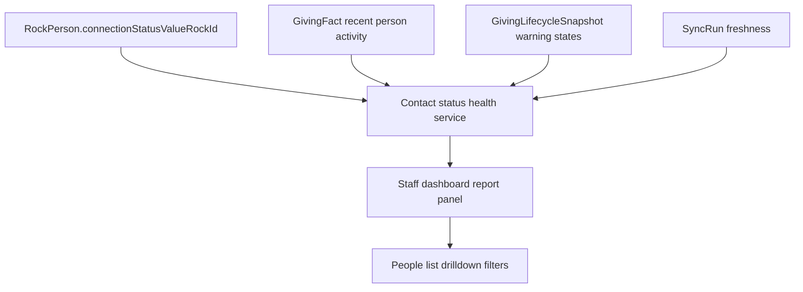

# feat: Add Contact Status Giving Health Report

## Summary

Build a staff-facing aggregate report that shows Healthy giving participation by Rock connection/contact status. The report should answer the immediate `Growing` leadership question and provide the same comparison for every populated Rock status.

---

## Problem Frame

Rock owns contact status. Abound owns giving lifecycle labels. Staff need one place where those concepts meet, without exporting Rock data or redefining status and lifecycle language.

The origin brainstorm records the current Rock aggregate context: `Growing` has 505 people, and there are 10 populated contact statuses. Healthy percentages were not available from the live Rock-only query because Healthy is derived inside Abound.

---

## Requirements

**Metric Definition**

- R1. The implementation must group people by `RockPerson.connectionStatusValueRockId` and display the related Rock defined-value label.
- R2. The implementation must count Healthy people using the same Abound lifecycle semantics used by the dashboard and People list.
- R3. The implementation must calculate Healthy percentage as Healthy people divided by total people in that Rock status.
- R4. The implementation must include `Growing` and every other populated Rock connection/contact status.

**Report Output**

- R5. The report must show status label, total people, Healthy people, Healthy percentage, and counts for `New`, `Reactivated`, `At-risk`, and `Dropped`.
- R6. The report must show source freshness for Rock sync and lifecycle calculation data.
- R7. The report must show an unavailable state when Rock status data exists but lifecycle data is missing or stale enough that Healthy percentages would mislead.
- R8. The report should link each status/lifecycle segment to the existing People list filters where possible.

**Permissions and Privacy**

- R9. Aggregate counts may be shown to staff roles that can already view lifecycle dashboard data.
- R10. Drilldowns must use existing People list authorization and role-safe masking.
- R11. The implementation must not log names, emails, raw gift rows, payment data, or access tokens while calculating the report.

---

## Key Technical Decisions

- **Reuse current Healthy semantics:** Healthy should remain "recent giving in the last 90 days with no warning lifecycle," matching `lib/list-views/lifecycle-filtering.ts` and the dashboard lifecycle count behavior in `lib/giving/metrics.ts`.
- **Add a dedicated aggregate service:** Put contact-status reporting logic in `lib/giving/contact-status-health.ts` instead of expanding dashboard code, so UI, tests, and future GraphQL exposure can call one typed API.
- **Prefer query-time aggregation for the first pass:** The first implementation can calculate from `RockPerson`, `GivingFact`, and `GivingLifecycleSnapshot` at request time. A stored aggregate can come later if performance requires it.
- **Use People list URLs for drilldown:** Build drilldown links from existing query params such as `connectionStatus=Growing` and `lifecycle=HEALTHY` rather than adding a new detail page.
- **Keep aggregate visibility amount-free:** The report carries participation counts and lifecycle labels only, so it should not require `finance:read_amounts`; any person-level drilldown still inherits the People list's role behavior.

---

## High-Level Technical Design

The service should produce a status row for every populated Rock connection status. Healthy rows are people with recent platform-fund giving activity who are not currently represented by a non-Healthy lifecycle snapshot. Non-Healthy lifecycle counts come from current person lifecycle snapshots.

---

## Implementation Units

### U1. Contact Status Health Service

- **Goal:** Add a typed aggregate service that returns status rows, lifecycle counts, Healthy percentages, and freshness metadata.
- **Files:** Create `lib/giving/contact-status-health.ts`; update or reuse helpers from `lib/giving/metrics.ts`, `lib/list-views/lifecycle-filtering.ts`, and `lib/settings/funds.ts`.
- **Patterns:** Follow `getHouseholdDonorTrend()` and `personLifecycleCounts()` in `lib/giving/metrics.ts` for lifecycle counting and missing-table tolerance.
- **Requirements:** R1-R7, R11
- **Test Scenarios:**
  - `tests/unit/contact-status-health.test.ts` returns one row per populated connection status.
  - Healthy count excludes people with `NEW`, `REACTIVATED`, `AT_RISK`, or `DROPPED` snapshots.
  - Healthy count uses the enabled platform fund scope and fails closed when funds are unconfigured.
  - Duplicate lifecycle snapshot rows do not double-count a person.
  - Missing lifecycle snapshot table returns status counts with an unavailable Healthy state.
  - Freshness metadata reports latest sync and latest lifecycle window when present.
- **Verification:** `pnpm test -- tests/unit/contact-status-health.test.ts`

### U2. Dashboard Report Panel

- **Goal:** Add a dashboard panel that displays contact-status giving health and highlights `Growing`.
- **Files:** Update `app/page.tsx`, `components/dashboard/staff-dashboard.tsx`, and `tests/unit/app-smoke.test.tsx`; optionally add `components/dashboard/contact-status-health-panel.tsx` if the dashboard file becomes crowded.
- **Patterns:** Match the existing dashboard section style and number formatting in `components/dashboard/staff-dashboard.tsx`.
- **Requirements:** R4-R9
- **Test Scenarios:**
  - Dashboard renders status rows with total people, Healthy people, Healthy percentage, and warning lifecycle counts.
  - Dashboard highlights or otherwise makes the `Growing` row easy to find.
  - Dashboard shows the unavailable state when the service marks lifecycle data unavailable.
  - Pastoral Care can see aggregate status/lifecycle counts without amount-bearing values.
- **Verification:** `pnpm test -- tests/unit/app-smoke.test.tsx`

### U3. People List Drilldown Links

- **Goal:** Link report segments to existing People list filters for status and lifecycle.
- **Files:** Update the dashboard report component and add focused coverage in `tests/unit/app-smoke.test.tsx` or `tests/unit/list-view-shell.test.tsx`.
- **Patterns:** Use existing URL parameters from `lib/list-views/page-params.ts`: `connectionStatus` and `lifecycle`.
- **Requirements:** R8-R10
- **Test Scenarios:**
  - Clicking a status total links to `/people?connectionStatus=<status>`.
  - Clicking Healthy links to `/people?connectionStatus=<status>&lifecycle=HEALTHY`.
  - Clicking warning lifecycle counts links to the matching status plus lifecycle filter.
  - Status names with spaces or punctuation are encoded correctly in URLs.
- **Verification:** `pnpm test -- tests/unit/app-smoke.test.tsx tests/unit/list-view-shell.test.tsx`

### U4. Optional GraphQL Exposure

- **Goal:** Expose the aggregate through GraphQL only if another current consumer needs it outside the Next.js dashboard path.
- **Files:** If needed, update `lib/graphql/types/people.ts` or add a focused dashboard/reporting GraphQL type file and include it from `lib/graphql/schema.ts`; update `tests/integration/graphql-api.test.ts`.
- **Patterns:** Follow existing Pothos object refs and auth checks in `lib/graphql/types/list-views.ts`.
- **Requirements:** R5-R11
- **Test Scenarios:**
  - Authorized staff can query contact-status health rows.
  - Anonymous and access-needed users cannot query the report.
  - The GraphQL response does not include names, emails, gift rows, or amount fields.
- **Verification:** `pnpm test -- tests/integration/graphql-api.test.ts`

### U5. Documentation and Steve Response Update

- **Goal:** Update durable docs with the final metric definition and any implementation-time denominator decision.
- **Files:** Update `docs/architecture/data-model.md` or a new `docs/architecture/contact-status-giving-health.md` only if implementation introduces a reusable reporting boundary; update the origin brainstorm only if a planning assumption changes.
- **Patterns:** Keep Rock as source of truth and document Abound-derived lifecycle behavior.
- **Requirements:** R1-R7
- **Test Scenarios:** Documentation should name the denominator, Healthy definition, freshness behavior, and privacy boundary.
- **Verification:** `pnpm format:check`

---

## Scope Boundaries

- Do not create new Rock sync writes or mutate Rock contact statuses.
- Do not add a new giving lifecycle kind.
- Do not expose raw gift rows from the report.
- Do not add a new People drilldown page unless existing People list filters cannot support the link target.
- Do not build stored reporting snapshots in the first pass unless query-time aggregation is too slow on the local synced dataset.

---

## System-Wide Impact

- **Data boundary:** The report combines Rock-owned status data with Abound-owned derived lifecycle data.
- **Auth boundary:** Aggregate lifecycle participation is visible without amounts, but person drilldowns must retain existing role masking.
- **Performance:** Query-time aggregation may touch `RockPerson`, `GivingFact`, and `GivingLifecycleSnapshot`; implementation should avoid per-status N+1 queries.
- **Freshness:** The report should not present Healthy percentages as current if lifecycle snapshots or recent giving facts are unavailable.

---

## Risks & Dependencies

- **Fund scope dependency:** Healthy counts must honor enabled platform funds. If no platform fund set is configured, the report should avoid exposing all-fund giving as if it were valid.
- **Lifecycle snapshot semantics:** Current snapshots store non-Healthy states, while Healthy is derived from recent gifts excluding those states. The service must preserve that distinction.
- **Denominator ambiguity:** The first pass counts every person in a Rock contact status. Planning defers exclusions for inactive record status or deceased people until staff asks for that behavior.
- **Database availability:** The report requires a populated Abound database. Rock-only API queries can provide status denominators but not Healthy lifecycle percentages.

---

## Acceptance Examples

- AE1. **Growing leadership answer**
  - **Given:** `Growing` has 505 people and 300 are Healthy.
  - **When:** Staff opens the report.
  - **Then:** The `Growing` row shows 505 total people, 300 Healthy people, and 59.4% Healthy.

- AE2. **Unavailable lifecycle data**
  - **Given:** Rock status data exists and lifecycle snapshots are missing.
  - **When:** Staff opens the report.
  - **Then:** Status totals appear, and Healthy percentages show a clear unavailable state.

- AE3. **Role-safe status drilldown**
  - **Given:** A Pastoral Care user opens the `Growing` Healthy segment.
  - **When:** The user follows the drilldown link.
  - **Then:** The People list applies `connectionStatus=Growing` and `lifecycle=HEALTHY` while preserving role-safe masking.

---

## Sources / Research

- Origin: `docs/brainstorms/2026-06-08-contact-status-giving-health-requirements.md`
- Current lifecycle logic: `lib/giving/lifecycle.ts`
- Dashboard lifecycle counts: `lib/giving/metrics.ts`
- Healthy list filtering: `lib/list-views/lifecycle-filtering.ts`
- People status filters: `lib/list-views/page-params.ts`, `lib/list-views/people-list.ts`, `lib/list-views/connection-status-options.ts`
- Dashboard UI: `app/page.tsx`, `components/dashboard/staff-dashboard.tsx`
- Auth roles: `lib/auth/roles.ts`
- Tests to extend: `tests/unit/giving-metrics.test.ts`, `tests/unit/app-smoke.test.tsx`, `tests/unit/people-list-view.test.ts`, `tests/unit/list-view-shell.test.tsx`
