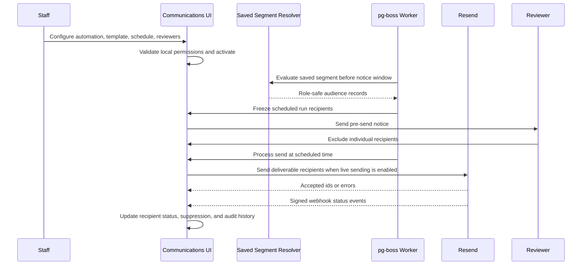
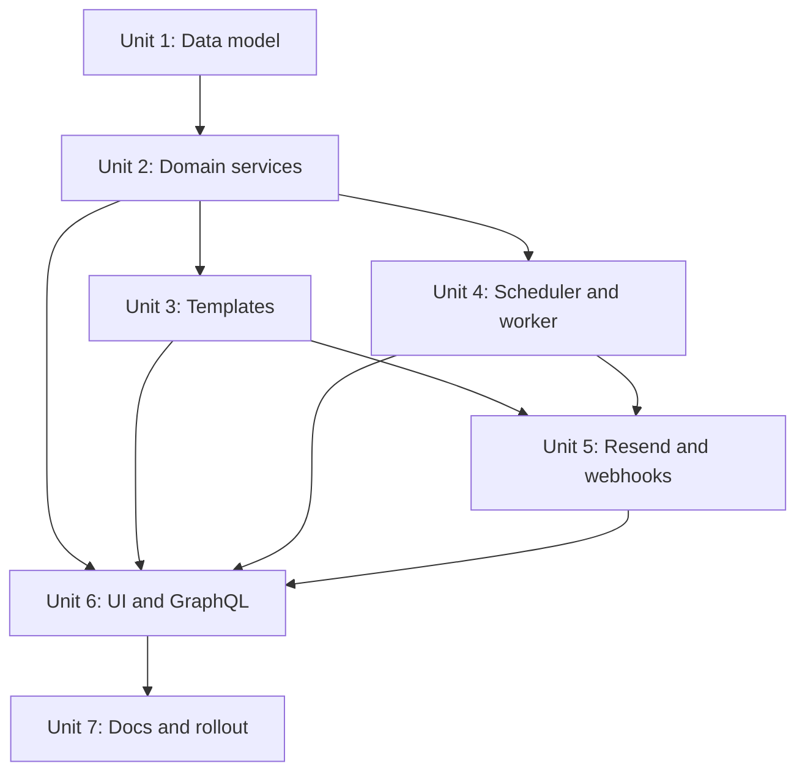

# feat: Add communication automations

## Overview

Add a staff-reviewed communication automation system for recurring segment-based emails, beginning with the `Joining` plus `Never Given` People segment. The implementation should turn the existing Communications workspace from handoff-only preparation into a controlled automation workflow with saved-segment audiences, recurring schedules, frozen scheduled runs, reviewer exclusion, structured React Email templates, Resend delivery, and audit history.

Production sending must remain gated until Resend sender setup and communication preference/suppression ownership are verified. The first delivery path should support a non-delivering capture/test mode so implementation can land safely before live email is enabled.

## Problem Frame

Staff need recurring outreach to people who are in a Rock-owned joining category and have never given, without manually rebuilding lists or silently sending donor-sensitive communications. Rock remains authoritative for people, connection status, and giving source data. The app owns local automation configuration, reviewer workflow, templates, Resend integration, and auditability (see origin: docs/brainstorms/2026-06-29-email-sending-communications-requirements.md).

This is a deep, cross-cutting feature. It touches persistent data, background jobs, third-party email delivery, local authorization, sensitive donor context, React UI, and operational docs.

## Requirements Trace

- R1-R2. Automations attach to safe saved app segments, with the first People segment using Rock connection status `Joining` and lifecycle `Never Given`.
- R3-R6. Automation setup includes recurring schedule, selected reviewers, active/inactive state, and activation before scheduled runs.
- R7-R11. Each run evaluates the segment before reviewer notice, freezes recipients, lets reviewers exclude individuals, and preserves run history.
- R12-R18. Resend is the production sender, accepted messages drive suppression, cooldown is configurable, missing/inactive emails are skipped, audit metadata stays minimal, and live sending is disabled until sender and preference ownership are verified.
- R19-R24. Emails use developer-owned React Email templates with structured editable fields, approved tokens, rendered preview, and test sends.
- R25-R28. Local roles authorize all automation actions; Pastoral Care must not see finance-only giving amounts; AI is review-only; no Rock writes are introduced.

## Scope Boundaries

- Do not build a drag-and-drop WYSIWYG email builder.
- Do not add SMS, push, direct mail, A/B testing, branching journeys, or delay-after-entry automations.
- Do not let staff write arbitrary HTML, CSS, or React template code in the app.
- Do not mutate Rock communication, people, connection-status, gift, or giving-lifecycle records.
- Do not use Rock as the production sender for this workflow.
- Do not enable live Resend sending until domain/from/reply-to configuration, secret handling, and communication preference/suppression ownership are verified.

### Deferred to Separate Tasks

- Resend-hosted template collaboration: React Email and Resend support hosted templates, but the first app implementation should keep developer-owned templates plus app-owned editable fields.
- Resend contact/audience management: keep recipient suppression local first; provider-side audience management can be reconsidered after communication preference ownership is settled.
- Delay-after-entry automation timing: defer until lifecycle/segment entry tracking is deliberately modeled.

## Context & Research

### Relevant Code and Patterns

- `prisma/schema.prisma` already has `CommunicationPrep`, `SavedListView`, `GivingLifecycleSnapshot`, local `AppUser`, and role fields.
- `lib/communications/prep.ts` owns communication prep creation, status updates, and `communications:manage` checks.
- `lib/communications/segments.ts` resolves role-safe audiences from saved views or filter definitions and returns contact readiness for previews.
- `lib/list-views/people-list.ts`, `lib/list-views/page-params.ts`, and `lib/list-views/lifecycle-filtering.ts` already support `connectionStatus` and `NEVER_GIVEN` filtering.
- `lib/sync/jobs.ts`, `scripts/sync-worker.ts`, `lib/settings/jobs.ts`, and `tests/unit/sync-jobs.test.ts` show the current pg-boss queue, schedule, singleton, and worker patterns.
- `lib/auth/roles.ts` currently grants `communications:manage` to Admin and Pastoral Care, while Finance lacks it.
- `app/communications/page.tsx`, `app/communications/[id]/page.tsx`, and `app/communications/actions.ts` are the existing UI/action surfaces to extend or split.
- `lib/graphql/types/communications.ts` exposes prep operations through the staff GraphQL boundary.

### Institutional Learnings

- `docs/solutions/best-practices/rock-sync-local-mirror-and-test-database-boundaries-2026-04-17.md` reinforces that app-owned workflow rows should use local generated IDs and preserve Rock IDs only as references.
- `docs/solutions/security-issues/nextjs-auth0-prisma-auth-foundation-guardrails-2026-04-17.md` reinforces that Auth0 identity is not authorization; active local users and local roles are required for staff data.

### External References

- Resend Node.js docs require an API key and verified domain before sending; keep these as production gates.
- Resend send API supports `react` content in the Node SDK, custom `tags`, and returns provider identifiers that can anchor recipient audit records.
- Resend webhook events distinguish `email.sent`, `email.delivered`, `email.failed`, `email.bounced`, `email.complained`, `email.delivery_delayed`, and `email.suppressed`; plan around `email.sent` as accepted-for-send and later events as delivery status updates.
- Resend webhook docs require signed webhook verification against the raw request body; webhook processing must be idempotent.
- React Email recommends Resend for sending, supports React templates, and documents Resend-hosted templates as a later collaboration path.

## Key Technical Decisions

- **Create automation-specific models instead of stretching `CommunicationPrep`:** Scheduled automation lifecycle, recurring configuration, recipients, exclusions, suppression, and provider events are distinct from prep/handoff records.
- **Use saved People segments as the audience boundary:** The first automation can be seeded from `Joining` plus `NEVER_GIVEN`, but all automation evaluation should flow through the existing list-view filter machinery.
- **Use pg-boss for scheduling and workers:** The repo already uses pg-boss for recurring sync schedules and worker telemetry; reuse that operational model rather than introducing a second scheduler.
- **Split permissions before live sending:** Add local permissions for automation setup/review/send readiness rather than overloading `communications:manage` for production email authority.
- **Treat Resend `email.sent` as the suppression event:** This aligns with the requirement that a recipient counts as received when Resend accepts the message for delivery attempt. Later webhook events update delivery health but should not undo suppression automatically.
- **Keep template editing structured:** Store editable content fields and tokens separately from developer-owned React Email components.
- **Store recipient snapshots intentionally:** Persist display/email snapshots and Rock person IDs needed for audit and suppression, but avoid storing raw rendered bodies or provider payloads.
- **Keep GraphQL parity for automation workflows:** Server actions can power the initial Next.js forms, but the app's preferred API boundary means automation reads and mutations should also be represented deliberately in GraphQL when the workflow becomes feature-bearing.

## Open Questions

### Resolved During Planning

- **How should recurring schedules be represented?** Use app-owned automation config plus pg-boss scheduled/enqueued jobs. Store the intended schedule on the automation and use pg-boss queues for evaluation, notification, and send processing.
- **What counts as Resend acceptance?** Use the successful send response and/or `email.sent` event as accepted-for-send; store the provider email id and update status idempotently if the webhook arrives later.
- **Should permissions split now?** Yes. Add explicit local permissions for activation/review/send readiness so production sending does not inherit broad prep-management access by accident.
- **Should the first version use Resend-hosted templates?** No. Use React Email components in the codebase with editable fields in the app; defer hosted Resend templates.

### Deferred to Implementation

- **Exact pg-boss queue names and schedule keys:** Choose names while implementing alongside existing `lib/sync/job-constants.ts` conventions.
- **Exact React Email package split:** Verify whether the current package versions require `react-email`, `@react-email/components`, or both when adding dependencies.
- **Exact Resend webhook payload shape:** Confirm against current SDK types while implementing, then map only required fields into local events.
- **Exact sender identity values:** Read from environment/config after church-provided domain, from address, and reply-to are available.

## High-Level Technical Design

> _This illustrates the intended approach and is directional guidance for review, not implementation specification. The implementing agent should treat it as context, not code to reproduce._

## Implementation Units

- [x] **Unit 1: Add automation data model**

**Goal:** Introduce app-owned persistence for automation configuration, scheduled runs, frozen recipients, exclusions, template field values, suppression, and provider events.

**Requirements:** R1-R18, R25-R28

**Dependencies:** None

**Files:**

- Modify: `prisma/schema.prisma`
- Create: `prisma/migrations/<timestamp>_add_communication_automations/migration.sql`
- Modify: `tests/integration/prisma-migrations.test.ts`
- Modify: `docs/architecture/data-model.md`

**Approach:**

- Add local generated-ID models for `CommunicationAutomation`, reviewer membership, template field values, scheduled run, run recipient, recipient event/provider event, and suppression records.
- Reference `SavedListView` for segment-backed automations and preserve `personRockId`/`householdRockId` snapshots for audit without pretending these are Rock-owned rows.
- Model status transitions explicitly enough to distinguish draft, active, paused, notice sent, ready to send, sending, sent, partial, failed, canceled, and skipped/excluded recipients.
- Store schedule fields in a way pg-boss can reproduce, including timezone, cadence/cron, pre-send notice interval, and next scheduled send metadata.
- Store suppression by automation and recipient resource/id, with provider accepted timestamp and optional cooldown eligibility timestamp.
- Keep rendered body storage out of scope; store template key/version plus editable fields and token values necessary to reproduce intent.

**Patterns to follow:**

- `CommunicationPrep` and `SavedListView` local-ID patterns in `prisma/schema.prisma`.
- Migration assertions in `tests/integration/prisma-migrations.test.ts`.
- App-owned row guidance in `docs/solutions/best-practices/rock-sync-local-mirror-and-test-database-boundaries-2026-04-17.md`.

**Test scenarios:**

- Integration: migration creates automation, run, recipient, suppression, reviewer, and provider-event tables/enums with foreign keys to app users, saved views, Rock people/households, and automation runs.
- Integration: migration indexes support lookup by automation status, next scheduled time, run status, person recipient, provider message id, and suppression eligibility.
- Edge case: nullable Rock references allow skipped/excluded recipients only when the resource type does not require the missing id; invalid resource/id combinations are prevented by service validation in Unit 2.

**Verification:**

- Prisma client generation can represent all new models and enums.
- Migration tests prove the intended tables, constraints, and indexes exist.

- [x] **Unit 2: Build automation domain services**

**Goal:** Add service-layer behavior for creating, updating, activating, pausing, evaluating, freezing, excluding, and suppressing automation recipients with local authorization.

**Requirements:** R1-R18, R25-R28

**Dependencies:** Unit 1

**Files:**

- Create: `lib/communications/automations.ts`
- Create: `lib/communications/automation-runs.ts`
- Create: `lib/communications/suppression.ts`
- Create: `lib/communications/automation-seeds.ts`
- Modify: `lib/communications/segments.ts`
- Modify: `lib/auth/roles.ts`
- Test: `tests/unit/communication-automations.test.ts`
- Test: `tests/unit/communication-automation-runs.test.ts`

**Approach:**

- Add focused local permissions such as manage, review, and send/activate for communication automations; map Admin to all and Pastoral Care to safe review/management only if product policy allows in the first implementation.
- Reuse `resolveCommunicationAudience` but add a full-run path that can page through the complete segment rather than only previewing 500 records.
- Add a helper that can create or locate the initial `Joining` plus `NEVER_GIVEN` People saved view for an authorized owner, using the existing filter schema rather than hard-coded SQL.
- Validate saved view ownership/visibility and resource compatibility at automation setup and again at run evaluation.
- Implement run freezing as a transactional operation: create run, snapshot matching recipients, mark skipped recipients for email readiness/suppression, and record the schedule timestamps used.
- Implement reviewer exclusion with actor, timestamp, and optional note. Exclusion should be per scheduled run and must not alter the saved segment.
- Implement suppression lookup before send based on automation id, resource kind, Rock id, and cooldown rules.
- Do not expose giving amounts or amount-derived explanations through automation notices or Pastoral Care-visible templates.

**Execution note:** Implement new domain behavior test-first; these services carry the business invariants that UI and workers depend on.

**Patterns to follow:**

- `lib/communications/prep.ts` for permission checks, normalization, and GraphQL-friendly errors.
- `lib/communications/segments.ts` for contact readiness and role-safe explanations.
- `lib/list-views/saved-views.ts` for saved view authorization.
- `lib/auth/permissions.ts` for local permission enforcement.

**Test scenarios:**

- Happy path: Admin creates an inactive automation from a People saved view, selected reviewers, recurring schedule, template key, and default never-resend suppression.
- Happy path: seed helper creates or returns a People saved view whose filters represent `connectionStatus=Joining` and `lifecycle=NEVER_GIVEN`.
- Happy path: activating a complete automation records activation metadata and makes it eligible for scheduled run creation.
- Happy path: scheduled evaluation of `connectionStatus=Joining` plus `lifecycle=NEVER_GIVEN` freezes matching people into run recipients.
- Happy path: reviewer excludes one recipient with a note; excluded recipient remains in run history and is not deliverable.
- Edge case: empty segment creates a run with zero deliverable recipients and no send job eligibility.
- Edge case: missing email or `emailActive=false` marks recipients skipped with non-sensitive reasons.
- Edge case: existing suppression prevents re-send when cooldown is absent or not elapsed.
- Edge case: elapsed cooldown permits a recipient to become deliverable again.
- Error path: Finance user cannot create, activate, review, exclude, or send automation work.
- Error path: automation cannot activate without saved segment, reviewers, schedule, template content, sender policy, and suppression configuration.
- Error path: saved view resource mismatch or inaccessible saved view fails before creating an automation.
- Integration: freezing recipients uses current segment membership but subsequent segment changes do not mutate the frozen run list.

**Verification:**

- Service tests cover activation gating, recipient freezing, review exclusions, suppression decisions, and permission denial.
- No service logs raw recipient email bodies, provider payloads, access tokens, or giving amounts.

- [x] **Unit 3: Add structured React Email templates**

**Goal:** Provide developer-owned email templates with staff-editable fields, approved tokens, rendered previews, and test-send rendering support.

**Requirements:** R19-R24, R26-R27

**Dependencies:** Unit 1, Unit 2

**Files:**

- Modify: `package.json`
- Modify: `pnpm-lock.yaml`
- Create: `emails/templates/joining-never-given.tsx`
- Create: `lib/communications/templates.ts`
- Create: `lib/communications/template-tokens.ts`
- Test: `tests/unit/communication-templates.test.tsx`

**Approach:**

- Add React Email dependencies needed for Next.js/server rendering and Resend SDK compatibility.
- Define a template registry with stable template keys, versions, field schemas, token allowlists, and preview defaults.
- Start with a `joining-never-given` template that exposes subject, preview text, heading, body copy, CTA label, CTA URL, and signature fields.
- Render templates from structured fields and approved person tokens only. Token resolution should fail closed for unknown tokens and provide safe fallback text for missing optional values.
- Generate both HTML/React content for sending and plain-text content when possible; if plain text is provider-generated, document that behavior in code comments or docs.
- Avoid arbitrary HTML/CSS and keep layout in code-owned React Email components.

**Patterns to follow:**

- Existing TypeScript service tests for pure domain helpers.
- Current UI copy style from `app/communications/[id]/page.tsx`.

**Test scenarios:**

- Happy path: `joining-never-given` renders with valid field values and a person recipient token context.
- Happy path: subject, preview text, CTA, and signature fields round-trip through normalized template field storage.
- Edge case: missing optional person token resolves to a safe fallback instead of leaking placeholder syntax.
- Error path: unknown token, unsupported template key, invalid CTA URL, or overly long subject/body field is rejected.
- Error path: attempted arbitrary HTML/script content is sanitized or rejected according to the chosen field rules.
- Integration: rendered preview for Pastoral Care token context contains no amount fields or individual giving aggregates.

**Verification:**

- Template tests prove the first template renders deterministically and rejects unsupported customization.
- Dependency changes are captured in `pnpm-lock.yaml`.

- [x] **Unit 4: Add scheduler and automation worker**

**Goal:** Use pg-boss to schedule automation evaluation, pre-send reviewer notices, and send processing with idempotent run creation.

**Requirements:** R3-R11, R16-R18

**Dependencies:** Unit 1, Unit 2

**Files:**

- Create: `lib/communications/automation-jobs.ts`
- Create: `scripts/communication-automation-worker.ts`
- Create: `scripts/communication-automation-schedule.ts`
- Modify: `lib/sync/job-constants.ts` or create `lib/communications/job-constants.ts`
- Modify: `lib/settings/jobs.ts`
- Modify: `components/settings/jobs-dashboard.tsx`
- Test: `tests/unit/communication-automation-jobs.test.ts`
- Test: `tests/unit/settings-jobs-summary.test.ts`

**Approach:**

- Add queues for automation evaluation, reviewer notification, and send processing. Use singleton keys per automation/run to avoid duplicate frozen runs and duplicate sends.
- Add scheduling helpers that register recurring automation evaluation from each active automation schedule.
- The evaluation job creates or finds the scheduled run for the target send window, freezes recipients, and enqueues or triggers reviewer notice.
- The notification job sends reviewer notices through the same email sender abstraction, but reviewer notices should be clearly separated from recipient automation emails.
- The send job only processes frozen runs whose review window has elapsed, automation remains active, and production/test delivery gates allow the selected sender mode.
- Record worker events or job telemetry in a way consistent with existing sync worker event patterns, without logging recipient lists.

**Patterns to follow:**

- `lib/sync/jobs.ts` for pg-boss queue creation, scheduling, singleton keys, and validation.
- `scripts/sync-worker.ts` for worker loop, `--once` posture, and event logging style.
- `lib/settings/jobs.ts` for surfacing queues/schedules in the jobs dashboard.

**Test scenarios:**

- Happy path: scheduling active automation registers pg-boss schedule with the configured cadence and stable key.
- Happy path: evaluation job creates one frozen run for a scheduled window and does not duplicate it when retried.
- Happy path: notice job marks reviewer notice sent and records aggregate counts.
- Happy path: send job refuses to send before the review window elapses and proceeds after it elapses.
- Edge case: paused automation causes evaluation/send jobs to no-op with an auditable skipped state.
- Edge case: zero deliverable recipients completes the run without calling the sender.
- Error path: invalid job data is rejected before touching recipient state.
- Error path: worker failure leaves run status retryable and does not create duplicate recipients on retry.
- Integration: jobs dashboard includes automation queues/schedules without exposing recipient PII.

**Verification:**

- Job tests prove scheduling, idempotency, review-window gating, and paused automation handling.
- Worker can be run in once mode during implementation verification without requiring Rock credentials.

- [x] **Unit 5: Integrate Resend sender and webhooks**

**Goal:** Add a sender adapter with capture/test mode, live Resend mode behind gates, recipient status updates, signed webhook ingestion, and suppression updates.

**Requirements:** R12-R18, R22-R23, R25-R28

**Dependencies:** Unit 2, Unit 3, Unit 4

**Files:**

- Create: `lib/communications/email-sender.ts`
- Create: `lib/communications/resend-sender.ts`
- Create: `app/api/webhooks/resend/route.ts`
- Modify: `.env.example` if present, or create/update project environment documentation in `docs/architecture/communications.md`
- Modify: `package.json`
- Modify: `pnpm-lock.yaml`
- Test: `tests/unit/communication-email-sender.test.ts`
- Test: `tests/unit/resend-webhook.test.ts`

**Approach:**

- Define an email sender abstraction with capture/test implementation and Resend implementation. The worker should depend on the abstraction, not the SDK directly.
- Add Resend SDK dependency and environment-based configuration for API key, webhook secret, sender identity, reply-to, and live-send enablement.
- Live sender must refuse to initialize or send unless required configuration is present and live sending is explicitly enabled.
- Send each recipient with provider tags for automation id, run id, recipient id, and template key when compatible with Resend tag constraints.
- On successful send API response, store provider email id and mark recipient as accepted/sent for suppression purposes. If webhooks are enabled, `email.sent` confirms the same state idempotently.
- Process signed Resend webhooks from raw request body and map provider events to local recipient/provider events. Do not trust unsigned requests.
- Treat bounces, complaints, failed, delayed, delivered, and suppressed events as delivery-state updates; do not automatically remove local suppression created by accepted sends.
- For test sends, allow sending only to authorized reviewer/staff addresses and clearly label the message as a test.

**Patterns to follow:**

- Next.js route-handler auth/error handling in existing `app/api/*` routes.
- Resend docs for verified domains, API key env var, send response handling, event taxonomy, and webhook signature verification.
- Existing redaction posture in `lib/sync/redaction.ts` and worker-event logging.

**Test scenarios:**

- Happy path: capture sender records intended recipient metadata without network calls.
- Happy path: Resend sender maps rendered React Email content, from/reply-to, subject, recipient, and safe tags to the SDK call.
- Happy path: successful Resend response marks recipient accepted, stores provider id, and creates suppression.
- Happy path: signed `email.sent` webhook idempotently confirms accepted status.
- Happy path: signed `email.delivered`, `email.bounced`, `email.failed`, `email.complained`, `email.delivery_delayed`, and `email.suppressed` events update recipient/provider event state.
- Edge case: duplicate webhook event is ignored or upserted idempotently.
- Edge case: webhook for unknown provider id is recorded safely or rejected according to the chosen support posture without crashing.
- Error path: live send without API key, sender identity, verified-live flag, or preference ownership flag fails closed.
- Error path: unsigned or invalid-signature webhook returns an unauthorized/bad-request response and changes no recipient state.
- Error path: Resend SDK error marks recipient failed without storing raw error payload or API key.
- Integration: accepted-send suppression prevents a later scheduled run from sending to the same person until cooldown permits it.

**Verification:**

- Sender and webhook tests cover success, provider failures, duplicate events, signature failure, and live-send gate failure.
- No production email can be sent unless live-send environment gates are deliberately configured.

- [x] **Unit 6: Build automation UI and GraphQL surface**

**Goal:** Add staff UI and GraphQL operations for automation setup, activation, run review, recipient exclusion, template editing/preview, test sends, and run status.

**Requirements:** R1-R28

**Dependencies:** Units 1-5

**Files:**

- Create: `app/communications/automations/page.tsx`
- Create: `app/communications/automations/[id]/page.tsx`
- Create: `app/communications/automations/actions.ts`
- Modify: `app/communications/page.tsx`
- Modify: `app/communications/[id]/page.tsx` if linking existing prep records to automation migration/handoff is useful
- Modify: `lib/graphql/types/communications.ts`
- Modify: `lib/graphql/schema.ts` if communication type registration requires new imports
- Create: `components/communications/automation-form.tsx`
- Create: `components/communications/automation-run-review.tsx`
- Create: `components/communications/template-editor.tsx`
- Test: `tests/unit/communication-automations-page.test.tsx`
- Test: `tests/unit/communication-automation-actions.test.ts`
- Test: `tests/unit/graphql-communications-automations.test.ts`

**Approach:**

- Add an Automations tab/entry inside Communications rather than replacing the existing prep list abruptly.
- Provide a setup form that selects a People saved view, schedule, pre-send notice interval, reviewers, suppression mode/cooldown, template, and sender mode.
- Include a fast path or seed affordance for the first `Joining` plus `Never Given` segment, but keep the automation itself saved-view-based.
- Show activation readiness as a checklist: saved segment, schedule, reviewers, template content, sender/test mode, suppression policy, and preference/sending gate.
- Provide structured template editor fields plus rendered preview, test-send action, and token preview.
- Provide run detail with frozen recipients, skipped/excluded/suppressed/deliverable counts, individual exclusion controls, notice/send timing, and provider status.
- Keep Pastoral Care views free of amount-bearing details and use care-context language.
- Add deliberate GraphQL fields/mutations for automation list/detail, activation readiness, run review, recipient exclusion, template preview metadata, and test-send/request actions. Keep mutation payloads narrow and backed by the same service functions as server actions.

**Patterns to follow:**

- Existing Communications page/detail layout in `app/communications/page.tsx` and `app/communications/[id]/page.tsx`.
- Existing server action auth pattern in `app/communications/actions.ts`.
- GraphQL type registration pattern in `lib/graphql/types/communications.ts`.
- Frontend density and enterprise UI conventions from `docs/design.md`.

**Test scenarios:**

- Happy path: Admin sees automation list, creates automation from saved People segment, edits template fields, selects reviewers, and sees activation readiness.
- Happy path: activated automation detail shows next scheduled send, pre-send notice timing, reviewer list, and suppression policy.
- Happy path: run review page lists frozen recipients and lets reviewer exclude one person with a note.
- Happy path: template preview renders personalized token output for a selected sample recipient.
- Happy path: test send action is available only when template and sender/test mode are valid.
- Happy path: GraphQL automation mutations enforce the same permission checks and validation as server actions.
- Edge case: no saved views shows an empty state that routes staff to create or select a segment.
- Edge case: frozen run with zero deliverable recipients shows completion/skipped state instead of a send button.
- Error path: Finance cannot load automation pages or call automation actions.
- Error path: unauthorized reviewer cannot exclude recipients from a run they are not allowed to review.
- Error path: activation action displays missing readiness items rather than partially activating.
- Integration: UI displays aggregate recipient status without raw provider payloads or finance-only giving data.
- Accessibility: forms have labels, error messages are associated with controls, buttons have stable disabled states, and recipient exclusion controls are keyboard reachable.

**Verification:**

- Page/action/GraphQL tests cover permission gates, readiness states, template preview, recipient exclusion, and status summaries.
- Manual browser verification covers desktop and mobile views for automation list, setup, detail, and run review.

- [x] **Unit 7: Update architecture docs and rollout guidance**

**Goal:** Document the new communication automation boundary, operational setup, production gates, and verification steps.

**Requirements:** R12-R18, R24-R28

**Dependencies:** Units 1-6

**Files:**

- Modify: `docs/architecture/communications.md`
- Modify: `docs/architecture/api-boundary.md`
- Modify: `docs/design.md` if Communications navigation/IA changes materially
- Create: `docs/research/resend-communication-automation.md`
- Modify: `AGENTS.md` only if new local commands are added

**Approach:**

- Replace the old "does not send email" architecture note with the new staged boundary: capture/test mode first, live Resend only after explicit gates.
- Record Resend environment variables, webhook verification requirements, sender-domain prerequisites, and how to disable live sending.
- Document suppression semantics: Resend acceptance suppresses future same-automation sends unless cooldown permits.
- Document the source-of-truth boundary for communication preferences and what remains unresolved before broad live use.
- If new worker scripts are added, document local commands and operational expectations.

**Patterns to follow:**

- Existing architecture-note style in `docs/architecture/communications.md`.
- Existing local command conventions in `AGENTS.md`.

**Test scenarios:**

- Test expectation: none for prose docs. The implementing agent should verify references match actual commands, file names, and environment variables after implementation.

**Verification:**

- Docs accurately describe implemented behavior, production gates, and remaining operational dependencies.

## System-Wide Impact

- **Interaction graph:** Communications UI/server actions/GraphQL call automation services; automation services call segment resolvers and template renderer; pg-boss worker creates runs and sends notices/emails; Resend webhooks update recipient events and suppression.
- **Error propagation:** UI should show validation/readiness errors; workers should record retryable failures without exposing PII; webhook failures should return safe HTTP errors and avoid partial state mutation.
- **State lifecycle risks:** Duplicate jobs, worker retries, webhook replays, paused automations, segment drift after freezing, and accepted-send suppression must all be idempotent.
- **API surface parity:** GraphQL automation mutations must enforce the same local permissions and validation as server actions.
- **Integration coverage:** Service tests must be supported by at least one cross-layer worker/send/webhook scenario so retry and idempotency assumptions are exercised.
- **Unchanged invariants:** Rock remains read-only for this workflow; Auth0 remains authentication only; Finance remains excluded from Communications automation workflows unless permissions change explicitly.

## Risks & Dependencies

| Risk                                                            | Likelihood | Impact | Mitigation                                                                                                                     |
| --------------------------------------------------------------- | ---------- | ------ | ------------------------------------------------------------------------------------------------------------------------------ |
| Accidental production email before readiness                    | Medium     | High   | Live sender fails closed unless explicit environment gates, verified sender config, and preference ownership flag are present. |
| Duplicate sends from worker retry or webhook replay             | Medium     | High   | Use singleton job keys, run/recipient idempotency, provider id uniqueness, and accepted-send suppression.                      |
| Sensitive donor data in logs or provider metadata               | Medium     | High   | Store minimal snapshots, safe provider tags, aggregate logs, and no raw rendered bodies/provider payloads.                     |
| Communication preferences or unsubscribes are not authoritative | Medium     | High   | Keep live sending disabled until ownership is documented and enforced.                                                         |
| Template customization breaks email clients                     | Medium     | Medium | Structured React Email fields only; no arbitrary HTML/CSS/layout editing; test sends before activation.                        |
| Pastoral Care sees amount-bearing context                       | Low        | High   | Reuse role-aware segment explanations and add tests for preview/notice/template output.                                        |
| Schedule timezone surprises                                     | Medium     | Medium | Store timezone explicitly, show next send/notice times in UI, and test schedule calculations.                                  |
| Resend API or webhook schema changes                            | Low        | Medium | Depend on SDK types, map only required fields, and isolate provider logic in `resend-sender` and webhook modules.              |

## Phased Delivery

### Phase 1: Safe Local Automation Core

- Unit 1, Unit 2, and capture-mode portions of Unit 4.
- Goal: staff can configure an inactive automation, freeze runs in tests, and review/exclude recipients without sending email.

### Phase 2: Template And Review Experience

- Unit 3 and Unit 6 without live sending.
- Goal: staff can edit structured template content, preview/test in capture mode, activate readiness, and review runs.

### Phase 3: Resend Integration Behind Gates

- Unit 5 and remaining Unit 4 worker send behavior.
- Goal: live Resend can be enabled only after sender/preference gates are deliberately configured.

### Phase 4: Operational Hardening

- Unit 7, settings jobs visibility, docs, manual browser checks, and rollout verification.
- Goal: operators can understand, monitor, disable, and troubleshoot automation sends.

## Documentation / Operational Notes

- Add local commands for automation scheduling/worker only after implementation chooses script names.
- Keep production enablement documented as a checklist: Resend API key, verified domain, from address, reply-to, webhook secret, preference/suppression owner, test send, and live flag.
- Add a rollback note: disabling the live-send flag and pausing automations should stop future sends without deleting audit history.
- Prefer seeded/synthetic data for screenshots and tests; do not capture real donor PII.

## Sources & References

- **Origin document:** [docs/brainstorms/2026-06-29-email-sending-communications-requirements.md](../brainstorms/2026-06-29-email-sending-communications-requirements.md)
- Existing communications architecture: [docs/architecture/communications.md](../architecture/communications.md)
- Existing data model architecture: [docs/architecture/data-model.md](../architecture/data-model.md)
- Existing sync/job architecture: [docs/architecture/sync-runner.md](../architecture/sync-runner.md)
- Existing local auth guidance: [docs/architecture/auth0-user-management.md](../architecture/auth0-user-management.md)
- Existing solution note: [docs/solutions/best-practices/rock-sync-local-mirror-and-test-database-boundaries-2026-04-17.md](../solutions/best-practices/rock-sync-local-mirror-and-test-database-boundaries-2026-04-17.md)
- Existing security note: [docs/solutions/security-issues/nextjs-auth0-prisma-auth-foundation-guardrails-2026-04-17.md](../solutions/security-issues/nextjs-auth0-prisma-auth-foundation-guardrails-2026-04-17.md)
- Resend Node.js docs: https://resend.com/docs/send-with-nodejs
- Resend send email API: https://resend.com/docs/api-reference/emails/send-email
- Resend webhook event types: https://resend.com/docs/webhooks/event-types
- Resend webhook verification: https://resend.com/docs/webhooks/verify-webhooks-requests
- Resend webhook retries/replays: https://resend.com/docs/webhooks/retries-and-replays
- React Email Resend integration: https://react.email/docs/integrations/resend
