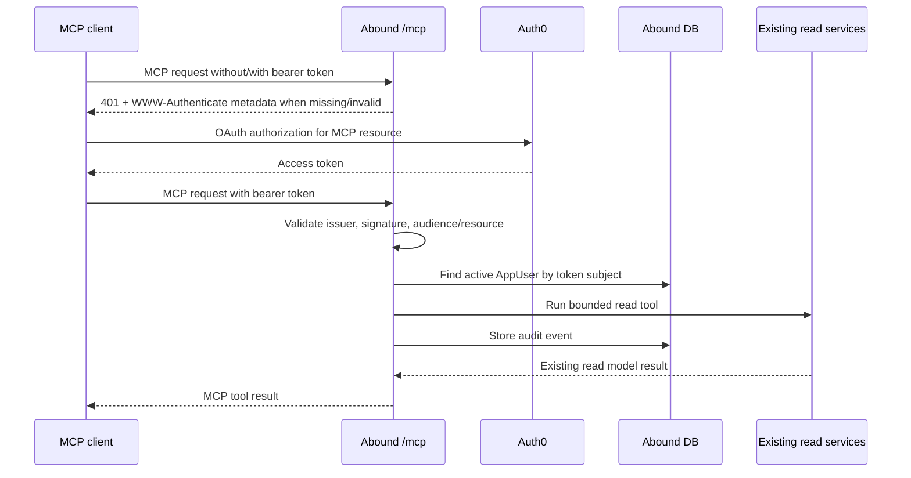

# feat: Add staff read-only MCP

## Overview

Add a remote, OAuth-protected MCP surface for Abound staff AI clients. The first version should expose existing read models through bounded MCP tools: profile reads, list/segment reads, giving summaries already present in profile/list services, and sync freshness. It should not add a new analytics layer, restore app roles, expose raw database querying, or mutate any Abound/Rock/payment/workflow state.

## Problem Frame

Staff want autonomous AI systems to answer useful questions about donor giving and household context without exporting spreadsheets or building one-off reports. Abound already has local Rock mirror data, giving facts, profile projections, saved list views, lifecycle labels, and sync-status services. The MCP should make those existing staff read surfaces available to AI clients through a deliberate external protocol boundary (see origin: `docs/brainstorms/2026-07-21-staff-mcp-read-only-requirements.md`).

## Requirements Trace

- R1-R3. Staff connect through OAuth, and Abound accepts MCP requests only from Auth0-authenticated users with an active local `AppUser`.
- R4. MCP is read-only and must not expose tools that mutate Abound, Rock, payment, communication, pledge, task, sync, or schedule state.
- R5-R8. MCP tools expose existing person/household profile, list, segment, giving summary, lifecycle, communication context, task context, and sync freshness read models.
- R9-R12. Rock remains authoritative; no payment instruments, credentials, raw tokens, raw provider payloads, autonomous donor communication, or autonomous financial decisions.
- R13-R15. MCP calls are audited, bounded, paginated where needed, and fail with safe errors.

## Scope Boundaries

- Do not restore Finance, Pastoral Care, or Admin role behavior as part of this plan.
- Do not add donor self-service MCP access.
- Do not build payment, recurring gift, payment method, or donor-facing giving management tools.
- Do not query live Rock directly for MCP responses.
- Do not build a new AI-generated rich-summary storage layer.
- Do not expose unrestricted SQL, unrestricted Prisma, raw GraphQL passthrough, or arbitrary database querying.
- Do not add transaction-level donor ledger tools in v1.
- Do not add write-capable MCP tools.

## Context & Research

### Relevant Code and Patterns

- `lib/graphql/context.ts` resolves Auth0 session users into `anonymous`, `needs_access`, or `authorized` local app access states, and `requireStaffUser` produces safe `UNAUTHENTICATED`/`FORBIDDEN` errors.
- `lib/auth/access-control.ts`, `lib/auth/prisma-users.ts`, and `lib/auth/users.ts` contain the local active-user authorization pattern to reuse for bearer-token MCP access.
- `app/api/graphql/route.ts` shows the current Next.js App Router API route pattern.
- `lib/people/profiles.ts` already composes person and household read models with giving summaries, lifecycle labels, tasks, and communication context.
- `lib/giving/metrics.ts` already provides person and household giving summary calculations from `GivingFact`.
- `lib/list-views/people-list.ts`, `lib/list-views/households-list.ts`, `lib/list-views/saved-views.ts`, and `lib/graphql/types/list-views.ts` provide bounded list, saved segment, filter catalog, and cursor patterns.
- `lib/sync/status.ts` and `lib/graphql/types/sync.ts` provide sync freshness and source counts.
- `tests/unit/graphql-auth.test.ts`, `tests/integration/graphql-api.test.ts`, `tests/unit/people-profiles.test.ts`, `tests/unit/people-list-view.test.ts`, `tests/unit/households-list-view.test.ts`, and `tests/unit/saved-list-views.test.ts` show the relevant testing style.

### Institutional Learnings

- `docs/solutions/security-issues/nextjs-auth0-prisma-auth-foundation-guardrails-2026-04-17.md`: Auth0 proves identity, but local access state must be resolved inside every server-side boundary; generic upserts and auth shortcuts have caused regressions before.
- `docs/solutions/best-practices/rock-sync-local-mirror-and-test-database-boundaries-2026-04-17.md`: Rock mirror data should remain local read-only reporting data, with Rock IDs preserved and fake fixture data isolated from live sync data.
- `docs/solutions/best-practices/shared-staff-access-and-migration-deploy-verification-2026-07-21.md`: Current main intentionally treats active local `AppUser` as the equal staff access boundary; do not leave pretend permission layers behind.

### External References

- MCP authorization spec: HTTP MCP servers with authorization should act as OAuth protected resources, expose protected resource metadata, challenge with `WWW-Authenticate` when unauthorized, require bearer tokens on every request, and validate tokens for the intended resource.
- MCP transport spec: remote MCP should use HTTP transport; Streamable HTTP supports POST and GET, with optional SSE for streaming.
- Auth0 access-token validation docs: APIs should validate JWT signature, issuer/standard claims, audience, and permissions/scopes as applicable.
- Official MCP TypeScript SDK: use the official SDK as the default implementation path unless planning-time package validation or Next.js runtime constraints prove it unsuitable.

## Key Technical Decisions

- Build MCP as a Next.js App Router API surface in the existing app: This keeps access to local services, Prisma, environment configuration, and deployment topology simple.
- Use existing service functions directly instead of calling internal GraphQL over HTTP: GraphQL is a useful contract reference, but MCP can avoid extra serialization, HTTP-internal auth coupling, and schema drift by calling the same services the GraphQL resolvers call.
- Use one broad MCP read capability for v1: The product decision is that active staff get the full read surface. Token validation should still require a token intended for the MCP resource, but v1 does not need per-tool user scopes.
- Expose curated MCP tools, not raw query passthrough: High autonomy comes from broad bounded tools over existing read models, not arbitrary SQL/Prisma/GraphQL.
- Keep v1 summary/profile/list based: The repo has synced transactions and `GivingFact`, but no current staff API explicitly intended as a raw donor transaction ledger. Transaction-level detail should remain out of v1.
- Add persistent audit logging for MCP tool calls: The MCP is an external AI-facing boundary over sensitive donor data, so in-process logs alone are not enough.

## Open Questions

### Resolved During Planning

- Should v1 expose transaction-level donor records? No. Existing safe read models are profile/list summaries, not a transaction ledger; adding ledger access would be separate product/security work.
- Should MCP tools call GraphQL internally? No. Use shared domain services directly, with GraphQL as a reference for field selection and tests.
- Should v1 add MCP-specific role/scope trimming? No. Match current active-staff access while still validating OAuth tokens for the MCP resource.

### Deferred to Implementation

- Exact MCP SDK adapter shape in Next.js: Validate the current official SDK route-handler integration details while implementing.
- Exact Auth0 configuration values: Derive names from environment conventions, but final issuer/audience/resource values depend on the tenant/API configuration.
- Exact audit event schema fields: Keep the shape minimal, but finalize names when adding the migration.

## Output Structure

    app/
      .well-known/
        oauth-protected-resource/
          route.ts
      mcp/
        route.ts
    lib/
      mcp/
        audit.ts
        auth.ts
        errors.ts
        server.ts
        tools.ts
        tool-schemas.ts
    tests/
      unit/
        mcp-auth.test.ts
        mcp-tools.test.ts
        mcp-audit.test.ts
      integration/
        mcp-route.test.ts

This tree is the expected shape, not a rigid constraint. If the official SDK or Next.js route mechanics point to a cleaner layout during implementation, keep the same boundaries and update the plan notes.

## High-Level Technical Design

> _This illustrates the intended approach and is directional guidance for review, not implementation specification. The implementing agent should treat it as context, not code to reproduce._

## Implementation Units

- [x] **Unit 1: Add MCP Dependencies and Configuration**

**Goal:** Add the MCP and token-validation dependencies plus explicit environment configuration for the remote MCP resource.

**Requirements:** R1-R3, R10, R15

**Dependencies:** None

**Files:**

- Modify: `package.json`
- Modify: `pnpm-lock.yaml`
- Modify: `.env.example`
- Test: `tests/unit/mcp-auth.test.ts`

**Approach:**

- Add the official MCP TypeScript SDK for server/tool protocol handling.
- Add a JWT validation dependency such as `jose` unless an existing dependency provides complete Auth0 access-token validation with JWKS support.
- Add environment placeholders for Auth0 issuer, MCP audience/resource identifier, and public MCP base URL.
- Keep Auth0 browser-session configuration separate from MCP bearer-token validation.

**Patterns to follow:**

- `package.json` dependency style.
- `.env.example` naming and comments.
- `lib/auth/auth0.ts` for current Auth0 env naming, while keeping bearer-token validation separate from session-cookie auth.

**Test scenarios:**

- Happy path: config loader accepts a complete Auth0 issuer, MCP audience/resource, and MCP base URL.
- Error path: missing required MCP auth config fails fast with a safe configuration error.
- Edge case: configured base URL is normalized consistently for resource/audience comparison.

**Verification:**

- Dependencies install from the lockfile.
- MCP auth configuration can be loaded in tests without requiring real Auth0 credentials.

- [x] **Unit 2: Implement MCP Bearer Auth and Protected Resource Metadata**

**Goal:** Add the OAuth resource-server boundary required for remote MCP clients.

**Requirements:** R1-R3, R10, R15

**Dependencies:** Unit 1

**Files:**

- Create: `lib/mcp/auth.ts`
- Create: `lib/mcp/errors.ts`
- Create: `app/.well-known/oauth-protected-resource/route.ts`
- Test: `tests/unit/mcp-auth.test.ts`
- Test: `tests/integration/mcp-route.test.ts`

**Approach:**

- Validate `Authorization: Bearer <token>` on every MCP request.
- Validate JWT signature via Auth0 JWKS, issuer, expiry/standard claims, and audience/resource binding for the MCP API.
- Resolve the token subject through the local `AppUser` repository. Missing/inactive local users receive `403`; missing/invalid tokens receive `401`.
- Return `WWW-Authenticate` challenges with a `resource_metadata` URL for unauthorized MCP requests.
- Serve protected resource metadata from the well-known route with the MCP resource identifier and Auth0 authorization server location.
- Do not accept ID tokens, Auth0 Management API tokens, query-string tokens, or tokens intended for another API.

**Patterns to follow:**

- `lib/graphql/context.ts` safe auth errors.
- `lib/auth/access-control.ts` and `lib/auth/prisma-users.ts` local access-state resolution.
- `app/api/graphql/route.ts` App Router route export style.

**Test scenarios:**

- Happy path: a valid Auth0 access token for the MCP audience whose `sub` maps to an active local user resolves to that `LocalAppUser`.
- Error path: missing bearer token returns `401` and includes protected resource metadata discovery.
- Error path: expired token, wrong issuer, wrong audience/resource, malformed token, or ID-token-shaped input is rejected with `401`.
- Error path: valid token for a user without active local `AppUser` is rejected with `403`.
- Safety: auth errors do not include raw tokens, Auth0 claims, stack traces, or database internals.
- Integration: the well-known metadata route returns the configured resource and authorization server values.

**Verification:**

- MCP route auth can be tested with mocked JWKS/token verification and local user lookup.
- Unauthorized clients receive enough metadata to begin OAuth without exposing internals.

- [x] **Unit 3: Build the Read-Only MCP Server and Tool Registry**

**Goal:** Create the MCP route and register the v1 read-only tools over existing service functions.

**Requirements:** R4-R8, R11-R12, R14-R15

**Dependencies:** Units 1-2

**Files:**

- Create: `app/mcp/route.ts`
- Create: `lib/mcp/server.ts`
- Create: `lib/mcp/tools.ts`
- Create: `lib/mcp/tool-schemas.ts`
- Test: `tests/unit/mcp-tools.test.ts`
- Test: `tests/integration/mcp-route.test.ts`

**Approach:**

- Use Streamable HTTP through the official MCP SDK if it fits the App Router runtime; otherwise create the thinnest compatible route adapter around the SDK server.
- Register a compact v1 tool set:
  - `get_staff_context`: return active staff identity fields safe for clients.
  - `get_sync_status`: return sync freshness, recent run, open issue summary, and synced counts.
  - `list_saved_segments`: list saved people/household views.
  - `get_filter_catalog`: expose valid filter fields/operators for people or household lists.
  - `query_people`: call `listPeople` with `savedViewId` or validated `filterDefinition`, bounded `first`, and optional cursor.
  - `query_households`: call `listHouseholds` with the same bounded list pattern.
  - `get_person_profile`: call `getRockPersonProfile`.
  - `get_household_profile`: call `getRockHouseholdProfile`.
- Return structured JSON content from tools with stable field names that mirror existing service output.
- Do not expose GraphQL execution, Prisma models, SQL, mutation services, sync runners, communication sending, task creation, pledge updates, or access approval operations.

**Patterns to follow:**

- `lib/graphql/types/people.ts` for profile field selection.
- `lib/graphql/types/list-views.ts` for list and saved view argument shapes.
- `lib/graphql/types/sync.ts` for sync status bounds.
- Existing list service caps and cursor behavior in `lib/list-views/people-list.ts` and `lib/list-views/households-list.ts`.

**Test scenarios:**

- Happy path: each registered tool calls the expected existing service with the authenticated local staff user.
- Happy path: profile tools return person/household profile data including existing giving summary fields when present.
- Happy path: list tools accept either a saved view id or filter JSON and return edges plus pageInfo.
- Edge case: list tools clamp or reject oversized `first` values according to existing list limits.
- Error path: invalid Rock IDs, missing saved views, invalid filter JSON, and service `GraphQLError`s become safe MCP tool errors.
- Safety: registered tools contain no write-capable operations and no arbitrary query passthrough.

**Verification:**

- Tool inventory matches the v1 list and contains only read-only tools.
- Tool responses are sufficient for an AI client to discover segments, fetch profiles, and cite sync freshness.

- [x] **Unit 4: Add MCP Audit Logging**

**Goal:** Persist minimal, privacy-aware audit events for MCP tool calls.

**Requirements:** R13, R15

**Dependencies:** Unit 3

**Files:**

- Modify: `prisma/schema.prisma`
- Create: `prisma/migrations/<timestamp>_add_mcp_audit_events/migration.sql`
- Create: `lib/mcp/audit.ts`
- Modify: `lib/mcp/tools.ts`
- Test: `tests/unit/mcp-audit.test.ts`
- Test: `tests/integration/prisma-migrations.test.ts`

**Approach:**

- Add a local app-owned audit table for MCP calls.
- Store the authenticated `AppUser` link, tool name, timestamp, outcome status, safe error code, broad target type, target Rock IDs when explicitly requested, result count when relevant, and a request/session correlation id if available.
- Do not store raw bearer tokens, full input payloads, free-form AI prompts, raw donor PII, raw tool results, or full financial details.
- Ensure audit writes do not turn successful read tools into hard failures if audit persistence has a transient problem; prefer safe logging/error capture while preserving the main tool error policy.

**Patterns to follow:**

- App-owned table conventions in `prisma/schema.prisma`.
- Migration coverage in `tests/integration/prisma-migrations.test.ts`.
- Sensitive data rules from `docs/architecture/data-model.md`.

**Test scenarios:**

- Happy path: successful tool call records user id, tool name, status, safe target metadata, result count, and timestamp.
- Error path: failed tool call records safe error code without raw exception details.
- Safety: audit event creation rejects or omits raw token/prompt/result fields by construction.
- Migration: Prisma schema and migration create/drop the audit table consistently in the migration test harness.

**Verification:**

- MCP audit events are persisted for success and failure cases without storing sensitive payloads.
- Migration tests include the new audit table.

- [x] **Unit 5: Harden Route Behavior and Integration Tests**

**Goal:** Verify the MCP route works as an external read-only protocol boundary, not just as isolated tool functions.

**Requirements:** R1-R4, R10, R14-R15

**Dependencies:** Units 2-4

**Files:**

- Modify: `app/mcp/route.ts`
- Modify: `app/.well-known/oauth-protected-resource/route.ts`
- Test: `tests/integration/mcp-route.test.ts`

**Approach:**

- Exercise the route with representative MCP initialize/tool-list/tool-call requests using mocked auth.
- Confirm bearer auth is required per request and no cookie-session fallback is used.
- Confirm unsupported methods, malformed JSON-RPC, unknown tools, and write-like tool names fail safely.
- Confirm production-like errors are masked enough for external clients.

**Patterns to follow:**

- `tests/integration/graphql-api.test.ts` schema/API contract testing style.
- `app/api/graphql/route.ts` route export style.

**Test scenarios:**

- Integration: unauthenticated MCP request returns `401` with `WWW-Authenticate`.
- Integration: valid authenticated request can list tools.
- Integration: valid authenticated request can call `get_sync_status`.
- Integration: unknown tool returns a safe MCP error.
- Error path: malformed request body returns a safe client error.
- Safety: route never resolves Auth0 browser cookies as MCP authorization; bearer token validation is required.

**Verification:**

- MCP route behavior is covered at the request boundary.
- Tests prove the route cannot be used anonymously or with only a browser session cookie.

- [x] **Unit 6: Document MCP Contract and Operations**

**Goal:** Make the MCP contract, auth model, read-only boundary, and operational expectations durable.

**Requirements:** R1-R15

**Dependencies:** Units 1-5

**Files:**

- Create: `docs/architecture/mcp-read-only-staff-access.md`
- Modify: `docs/architecture/api-boundary.md`
- Modify: `.env.example`
- Modify: `docs/plans/2026-07-21-001-feat-staff-mcp-read-only-plan.md`

**Approach:**

- Document the MCP endpoint, OAuth/protected-resource metadata behavior, token validation expectations, active local user requirement, and full-read-staff posture.
- Document every v1 tool, including input bounds, output intent, and read-only guarantee.
- Document audit-event contents and sensitive-data exclusions.
- Update the plan with implementation progress notes during execution.

**Patterns to follow:**

- `docs/architecture/api-boundary.md` contract documentation style.
- `docs/architecture/auth0-user-management.md` auth posture documentation style.

**Test scenarios:**

- Test expectation: none for prose-only docs, but documentation should be reviewed against implemented tool names and env variables before completion.

**Verification:**

- A future implementer or operator can configure and reason about the MCP without reconstructing decisions from chat.

## System-Wide Impact

- **Interaction graph:** New external HTTP entry points call MCP auth, local app user lookup, existing read services, Prisma, and audit logging. Existing GraphQL/UI behavior should not change.
- **Error propagation:** Token/auth errors map to HTTP `401`/`403`; tool/service validation errors map to safe MCP errors; unexpected errors are masked and audited.
- **State lifecycle risks:** MCP is read-only except audit writes. Audit persistence should avoid partial business-state changes because no business state is mutated.
- **API surface parity:** MCP wraps existing staff read services. GraphQL remains available for app/UI consumers and should not be silently expanded or bypassed.
- **Integration coverage:** Request-boundary tests are required because unit tests alone will not prove bearer-token-only auth, metadata discovery, or MCP route behavior.
- **Unchanged invariants:** Rock remains source of truth; local mirror reads remain read-only; payment instruments/secrets/raw provider payloads remain unavailable; active local `AppUser` remains the staff access boundary.

## Risks & Dependencies

| Risk                                                             | Mitigation                                                                                                                                                                    |
| ---------------------------------------------------------------- | ----------------------------------------------------------------------------------------------------------------------------------------------------------------------------- |
| OAuth resource/audience mismatch makes clients unable to connect | Document explicit env values; test resource metadata and audience validation with mocked tokens.                                                                              |
| MCP SDK does not fit Next.js App Router cleanly                  | Keep SDK integration isolated in `lib/mcp/server.ts` and route adapter; verify during Unit 3 before expanding tools.                                                          |
| Tool responses leak more donor data than intended                | Reuse existing profile/list service projections; do not expose raw Prisma/GraphQL/SQL.                                                                                        |
| Audit logs accidentally store PII or prompts                     | Store narrow structured metadata only; test audit payload construction.                                                                                                       |
| AI clients need more autonomy than the tool set supports         | Start with filter catalog, saved segments, list queries, and profile fetches; defer raw transaction/query language until there is explicit product approval.                  |
| Current flat staff access is later replaced with scoped roles    | Keep auth resolution behind `lib/mcp/auth.ts` and pass `LocalAppUser` through tools so future authorization checks can be inserted without changing tool contracts wholesale. |

## Documentation / Operational Notes

- Add MCP environment variables to `.env.example`.
- Document how to configure the Auth0 API/audience/resource for MCP without placing real tenant secrets in docs.
- Document that MCP clients must request a token for the MCP resource and send `Authorization: Bearer` on every request.
- Document the initial tool inventory and the explicit absence of write tools.

## Sources & References

- **Origin document:** [docs/brainstorms/2026-07-21-staff-mcp-read-only-requirements.md](../brainstorms/2026-07-21-staff-mcp-read-only-requirements.md)
- Related architecture: [docs/architecture/api-boundary.md](../architecture/api-boundary.md)
- Related architecture: [docs/architecture/auth0-user-management.md](../architecture/auth0-user-management.md)
- Existing profile services: `lib/people/profiles.ts`
- Existing giving summaries: `lib/giving/metrics.ts`
- Existing list services: `lib/list-views/people-list.ts`, `lib/list-views/households-list.ts`, `lib/list-views/saved-views.ts`
- Existing sync status: `lib/sync/status.ts`
- MCP authorization spec: https://modelcontextprotocol.io/specification/2025-11-25/basic/authorization
- MCP transport spec: https://modelcontextprotocol.io/specification/2025-03-26/basic/transports
- Auth0 access-token validation: https://auth0.com/docs/secure/tokens/access-tokens/validate-access-tokens
- Official MCP TypeScript SDK: https://github.com/modelcontextprotocol/typescript-sdk
